#### 第1章

## 机器学习概览

不久前,如果你拿起⼿机问它回家的路,它会不理你,⼈们会质疑你的理智。但机器学习不再是科 幻⼩说:每天都有数⼗亿⼈在使⽤它。事实上,它已经在⼀些专业应⽤程序中存在了⼏⼗年,例如 光学字符识别(Optical Character Recognition,OCR)。第⼀个真正成为主流、改善数亿⼈⽣ 活的ML应⽤程序在20世纪90年代⻛靡全球:垃圾邮件过滤器。它不完全是⼀个具有⾃我意识的机 器⼈,但它在技术上确实称得上是机器学习:它实际上学得⾮常好,以⾄于你很少需要再将电⼦邮 件标记为垃圾邮件。紧随其后的是数百个ML应⽤程序,它们现在悄悄地为你经常使⽤的数百种产 品和功能提供⽀持:语⾳提示、⾃动翻译、图像搜索、产品推荐等。

机器学习从哪⾥开始,⼜在哪⾥结束呢?机器进⾏学习到底意味着什么?如果我下载了所有维基百 科⽂章的副本,我的计算机就真的学会了什么吗?它突然变聪明了吗?在本章中,我将⾸先阐明什 么是机器学习,以及你为什么想要使⽤它。

在我们开始探索机器学习⼤陆之前,我们先看⼀看地图并了解这⽚⼤陆上的主要区域和最显著的地 标:监督学习与⽆监督学习及其变体、在线学习与批量学习、基于实例与基于模型的学习。然后, 我们将了解典型机器学习项⽬的⼯作流程,讨论你可能⾯临的主要挑战,并介绍如何评估和微调机 器学习系统。

本章将介绍每个数据科学家都应该牢记的许多基本概念(和专业术语)。虽然本章是概述(这是唯 ⼀没有太多代码的⼀章),相对简单,但我的⽬标是确保在我们继续阅读本书的其余部分之前,⼀ 切对你来说都是⾮常清楚的。所以喝杯咖啡,开始学习吧!

如果你已经熟悉机器学习基础知识,你可以直接跳到第2章。如果你不确定,可以尝试回答本章末 尾列出的所有问题,然后再继续。

# 1.1 什么是机器学习

机器学习是⼀⻔通过编程让计算机从数据中进⾏学习的科学(和艺术)。

下⾯是⼀个稍微通⽤⼀点的定义:

机器学习是⼀个研究领域让计算机⽆须进⾏明确编程就具备学习能⼒。

⸺亚瑟·塞缪尔(Arthur Samuel),1959

## 还有⼀个更⼯程化的定义:

⼀个计算机程序利⽤经验E来学习任务T,性能是P,如果针对任务T的性能P随着经验E不断增⻓, 则称为机器学习。

⸺汤姆·⽶切尔(Tom Mitchell),1997

例如,垃圾邮件过滤器就是⼀个机器学习程序,它可以根据给定的垃圾邮件(由⽤户标记)和普通 电⼦邮件(⾮垃圾邮件,也称为ham)学习标记垃圾邮件。系统⽤来学习的样例称为训练集。每个 训练样例称为训练实例(或样本)。机器学习系统中学习和做出预测的部分称为模型。例如,神经 ⽹络和随机森林就是模型。

在这个示例中,任务T是标记新邮件是否为垃圾邮件,经验E是训练数据,需要定义性能度量P,例 如,你可以使⽤正确分类电⼦邮件的⽐率。这种特殊的性能指标称为精度(accuracy),通常⽤ 于分类任务。

如果你只是下载所有维基百科⽂章的副本,那么虽然你的计算机会拥有更多的数据,但它并不会突 然变得更擅⻓任何任务。这不是机器学习。

## 1.2 为什么使⽤机器学习

考虑⼀下如何使⽤传统的编程技术编写垃圾邮件过滤器(⻅图1-1):

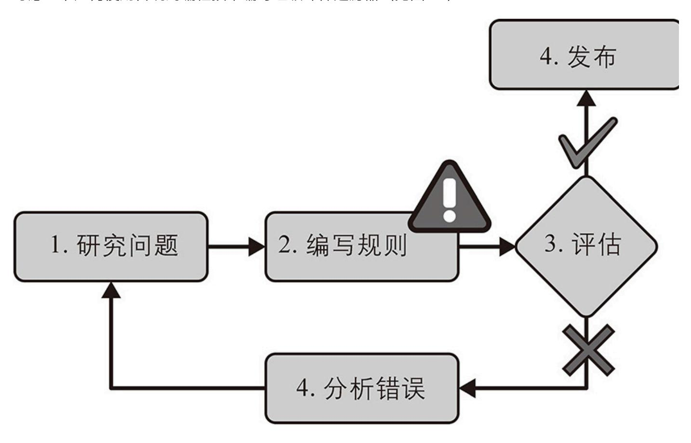

图1-1:传统⽅法

- 1. ⾸先,你会检查垃圾邮件通常是什么样⼦。你可能会注意到⼀些词或短语(例如"4U""信⽤ 卡""免费"和"惊⼈的")往往会在主题⾏中出现很多次。也许你还会注意到发件⼈姓名、电⼦邮件 正⽂和电⼦邮件其他部分中的⼀些其他模式。
- 2. 你会为你注意到的每个模式编写⼀个检测算法,如果检测到许多这样的模式,你的程序会将电 ⼦邮件标记为垃圾邮件。
- 3. 你会测试程序并重复步骤1和步骤2,直到它⾜够好可以发布。

由于这个问题很困难,因此你的程序很可能会变成⼀⻓串复杂的规则——很难维护。

相⽐之下,基于机器学习技术的垃圾邮件过滤器会⾃动学习词和短语,这些词和短语是垃圾邮件的 预测因素,通过与⾮垃圾邮件⽐较,检测垃圾邮件中反复出现的词语模式(⻅图1-2)。该程序更 短,更易于维护,也更准确。

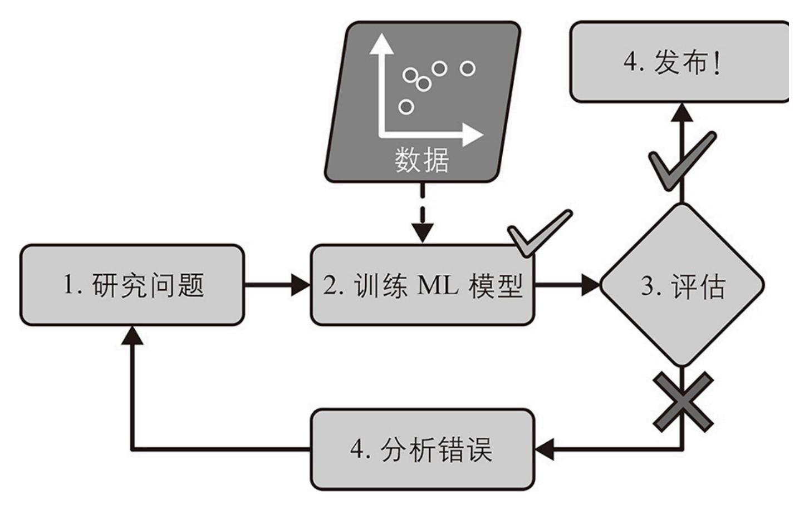

图1-2:机器学习⽅法

如果垃圾邮件发送者注意到他们所有包含"4U"的电⼦邮件都被阻⽌了怎么办?他们可能会转⽽ 写"For U"。使⽤传统编程技术的垃圾邮件过滤器需要更新来标记"For U"电⼦邮件。如果垃圾邮 件发送者⼀直绕过你的垃圾邮件过滤器,你就需要不断编写新规则。

相⽐之下,基于机器学习技术的垃圾邮件过滤器会⾃动注意到"For U"在⽤户标记的垃圾邮件中变 得异常频繁,并且在没有⼈⼯⼲预的情况下⾃动标记垃圾邮件(⻅图1-3)。

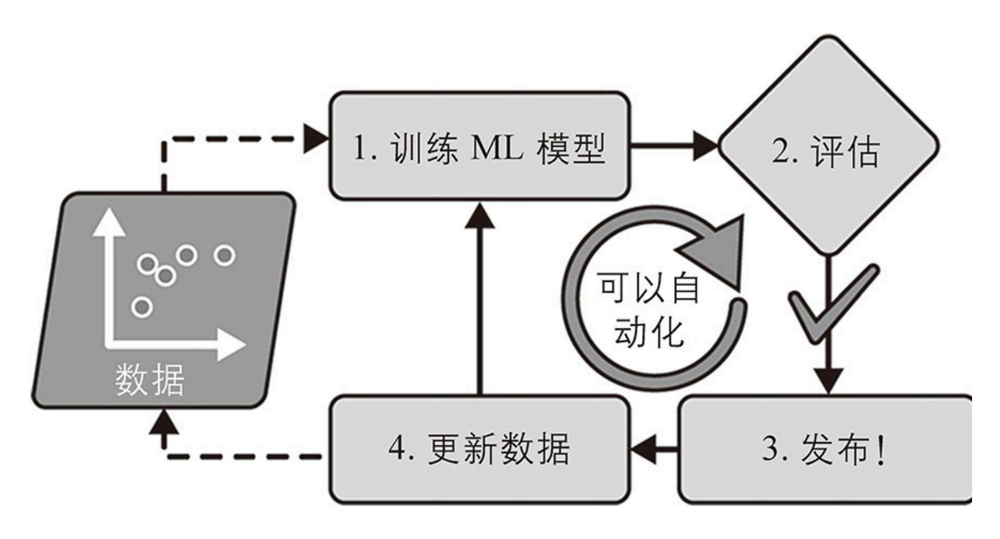

图1-3:⾃动适应变化

机器学习的另⼀个亮点是擅于处理对于传统⽅法过于复杂或没有已知算法的问题。例如,考虑语⾳ 识别,假设你想编写⼀个能够区分单词"one"和"two"的简单程序。你可能会注意到单词"two"以 ⾼⾳("T")开头,因此你会对测量⾼⾳强度的算法进⾏硬编码并使⽤它来区分"one"和"two", 但显然这种技术不能扩展到所有的语⾳识别(⼈们所处环境不同、语⾔不同、使⽤的词汇不同)。 最好的解决⽅案(⾄少在今天)是根据给定的⼤量单词录⾳示例,编写⼀个能够⾃我学习的算法。

最后,机器学习可以帮助⼈类进⾏学习(⻅图1-4)。可以检查ML模型来查看它们学到了什么(尽 管这对于某些模型来说可能很棘⼿)。例如,⼀旦垃圾邮件过滤器接受了⾜够多的垃圾邮件训练, 就可以⽤它列出垃圾邮件预测器的单词和单词组合。有时候这会揭示意想不到的相关性或新趋势, 从⽽更好地理解问题。挖掘⼤量数据来发现隐藏的模式称为数据挖掘,机器学习擅⻓于此。

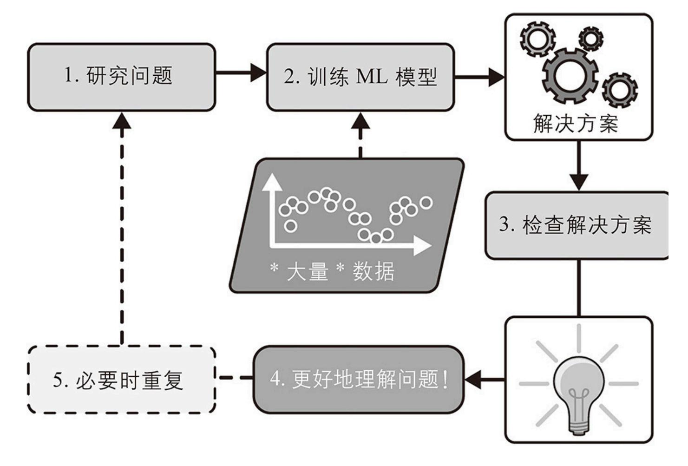

图1-4:机器学习可以帮助⼈类进⾏学习

### 总⽽⾔之,机器学习⾮常适合:

- ·现有解决⽅案需要有⼤量微调或⼀⻓串规则来解决的问题(机器学习模型通常可以简化代码并且 ⽐传统⽅法执⾏得更好)。
- ·使⽤传统⽅法⽆法解决的复杂问题(最好的机器学习技术可能会找到解决⽅案)。
- ·变化的环境(机器学习系统可以很容易地根据新数据重新训练,始终保持最新状态)。
- ·深⼊了解复杂问题和⼤量数据。

## 1.3 应⽤示例

让我们看⼀下机器学习任务的⼀些具体示例,以及可以解决这些任务的技术:

分析⽣产线上的产品图像来对产品进⾏⾃动分类

这是图像分类,通常使⽤卷积神经⽹络(CNN,⻅第14章),有时使⽤Transformer(⻅第16 章)。

#### 通过脑部扫描发现肿瘤

这是语义图像分割,其中图像中的每个像素都被分类(因为我们想要确定肿瘤的确切位置和形 状),通常使⽤CNN或Transformer。

#### ⾃动分类新闻⽂章

这是⾃然语⾔处理,更具体地说是⽂本分类,可以使⽤循环神经⽹络和CNN来解决,但 Transformer效果更好(⻅第16章)。

⾃动标记论坛中的恶评

这也是⽂本分类,使⽤相同的NLP⼯具。

⾃动对⻓⽂档做总结

这是NLP的⼀个分⽀,称为⽂本摘要,使⽤相同的⼯具。

创建聊天机器⼈或个⼈助理

这涉及许多NLP组件,包括⾃然语⾔理解(Natural Language Understanding,NLU)和问答模 块。

根据许多绩效指标来预测公司下⼀年的收⼊

这是⼀个回归任务(即预测值),可以使⽤任何回归模型来解决,例如线性回归或多项式回归模型 (⻅第4章)、回归⽀持向量机(⻅第5章)、回归随机森林(⻅第7章)或⼈⼯神经⽹络(⻅第10 章)。如果你考虑过去的绩效指标,你可能需要使⽤RNN、CNN或Transformer(⻅第15章和第16 章)。

让应⽤程序对语⾳命令做出反应

这是语⾳识别,需要处理⾳频样本:由于它们是很⻓、很复杂的序列,因此通常使⽤RNN、CNN 或Transformer进⾏处理(⻅第15章和第16章)。

检测信⽤卡欺诈

这是异常检测,可以使⽤隔离森林、⾼斯混合模型(⻅第9章)或⾃动编码器(⻅第17章)来解 决。

根据客户的购买情况对客户进⾏细分,从⽽你可以为每个细分设计不同的营销策略

这就是聚类,可以使⽤k均值、DBSCAN等来实现(⻅第9章)。

在清晰⼜有洞察⼒的图表中表示复杂的⾼维数据集

这是数据可视化,通常涉及降维技术(⻅第8章)。

根据过去的购买情况推荐客户可能感兴趣的产品

这是⼀个推荐系统。⼀种⽅法是将过去的购买情况(以及有关客户的其他信息)提供给⼈⼯神经⽹ 络(⻅第10章),并让它输出客户下⼀次最有可能购买的产品。这个神经⽹络通常会根据所有客户 过去的购买记录进⾏训练。

为游戏构建智能机器⼈

这通常使⽤强化学习(Reinforcement Learning,RL;⻅第18章)来解决。强化学习是机器学习 的⼀个分⽀,它在给定的环境(例如游戏)中,训练智能体(例如机器⼈)选择能够随着时间的推 移最⼤化其奖励的⾏动(例如,机器⼈可能会在玩家每次失去⼀些⽣命点数时获得奖励)。在围棋 ⽐赛中打败世界冠军的著名AlphaGo程序就是使⽤RL构建的。

这个列表可以⼀直延伸下去,但希望它能让你了解机器学习可以处理任务的⼴度和复杂性,以及你 在每项任务中会⽤到的技术类型。

## 1.4 机器学习系统的类型

现有的机器学习系统类型繁多,为便于理解,我们根据以下标准将它们分为⼤类:

- ·它们在训练期间是如何受到监督(监督、⽆监督、半监督、⾃我监督等)的。
- ·它们是否可以即时增量地学习(在线学习与批量学习)。
- ·它们是通过简单地将新数据与已知数据进⾏⽐较来⼯作,还是通过检测训练数据中的模式并建⽴ 预测模型来⼯作,就像科学家所做的那样(基于实例的学习与基于模型的学习)。

这些标准不是唯⼀的,你可以按照⾃⼰喜欢的⽅式将其任意组合。例如,最先进的垃圾邮件过滤器 可以使⽤深度神经⽹络模型来在线即时学习,该模型可以使⽤⼈类提供的垃圾邮件和⾮垃圾邮件样 例进⾏训练。这使它成为⼀个在线的、基于模型的监督学习系统。

让我们更仔细地看看这些标准。

#### 1.4.1 训练监督

根据训练期间得到的监督数量和监督类型,可以将机器学习系统分为以下五个主要类别:监督学 习、⽆监督学习、⾃监督学习、半监督学习和强化学习。

#### 监督学习

在监督学习中,提供给包含所需解决⽅案的算法的训练集,称为标签(⻅图1-5)。

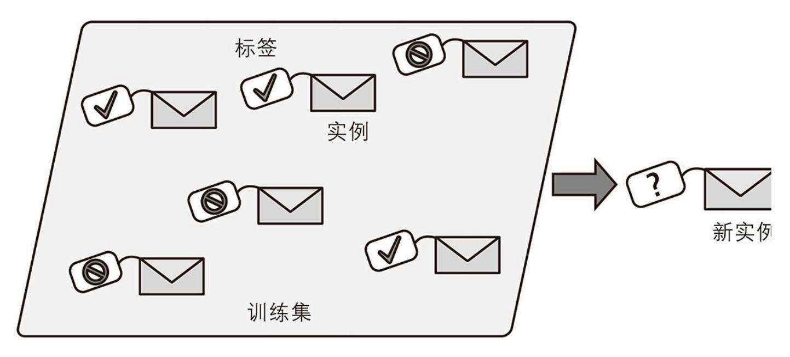

图1-5:⽤于垃圾邮件分类的已标记训练集(监督学习的⽰例)

典型的监督学习任务是分类。垃圾邮件过滤器就是⼀个很好的示例:它⽤许多电⼦邮件及其类别 (垃圾邮件或⾮垃圾邮件)来训练,并且它必须学习如何对新电⼦邮件进⾏分类。

有趣的事实:这个听起来很奇怪的名字是Francis Galton在研究⾼个⼦的孩⼦往往⽐⽗⺟矮的事实 时引⼊的⼀个统计术语。由于孩⼦⽐⽗⺟要矮⼀些,他称这种现象为回归到均值。这个术语后来被 他应⽤于分析变量之间相关性的⽅法上。

另⼀个典型的任务是在给定⼀组特征(⾥程、年龄、品牌等)的情况下来预测⽬标数值,例如汽⻋ 的价格。这种任务称为回归(⻅图1-6) [。](#page-7-0)要训练这个系统,你需要给它许多汽⻋样例,包括它 们的特征和⽬标(即它们的价格)。

请注意,某些回归模型也可⽤于分类,反之亦然。例如,逻辑回归通常⽤于分类,因为它可以输出 对应于属于给定类别的概率值(例如,20%的概率是垃圾邮件)。

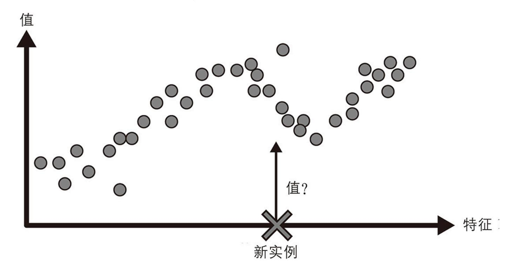

图1-6:⼀个回归问题⸺给定输⼊特征的情况下预测值(通常有多个输⼊特征,有时也有多个输出 值)

⽬标(target)和标签(label)这两个词在监督学习中通常被视为同义词,但⽬标在回归任务中更 常⻅,⽽标签在分类任务中更常⻅。此外,特征有时也称为预测变量或属性。这些术语可能指单个 样本(例如,"这辆⻋的⾥程特征是等于15000")或所有样本(例如,"⾥程特征与价格密切相 关")。

#### ⽆监督学习

在⽆监督学习中,正如你可能猜到的那样,训练数据是未标记的(⻅图1-7)。系统试图在没有⽼ 师的情况下进⾏学习。

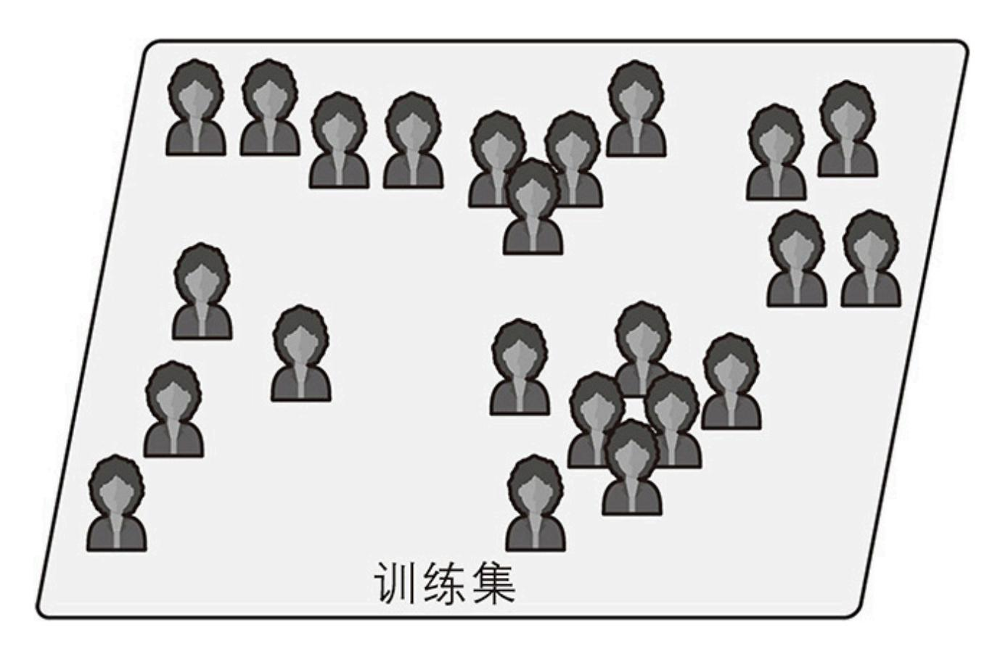

图1-7:⽤于⽆监督学习的⽆标签训练集

例如,假设你有⼤量关于博客访客的数据。你可能想要运⾏聚类算法来检测相似访客的分组(⻅图 1-8)。你不会告诉算法访客属于哪个组:它⽆须你的帮助即可找到这种关联。例如,它可能会注 意到40%的访客是喜欢漫画书的⻘少年,通常在放学后阅读你的博客,⽽20%的访客是喜欢科幻 ⼩说的成年⼈,并通常在周末访问。如果你使⽤层次聚类算法,它还可以将每个组细分为更⼩的 组。这可以帮助你针对不同的组来发布博客内容。

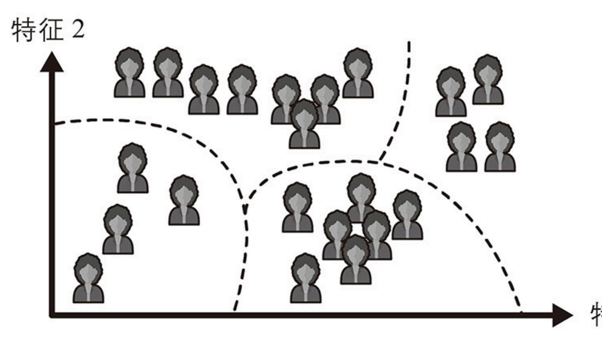

图1-8:聚类

可视化算法也是⽆监督学习的⼀个好示例:你提供⼤量复杂且未标记的数据,算法轻松绘制输出 2D或3D的数据表示(⻅图1-9)。这些算法试图尽可能多地保留结构(例如,试图防⽌输⼊空间 中的单独集群在可视化中重叠),以便于你可以了解数据的组织⽅式,并可能识别出⼀些未知的模 式。

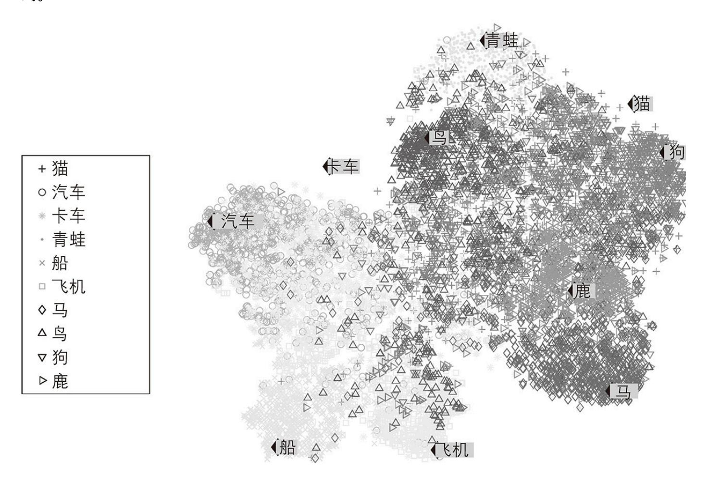

注意,动物与⻋辆可能离得很远,⻢与⿅的距离近但和⻦的距离远。图的使⽤得到了Richard Socher等⼈许可,"Zero-Shot Learning Through Cross-Modal Transfer",Proceedings of the th International Conference on Neural Information Processing Systems (2013):935-943。

图1-9:突出显⽰语义集群的t-SNE可视化⽰例

与之相关的⼀个任务是降维,其⽬标是在不丢失太多信息的情况下简化数据。⼀种⽅法是将⼏个相 关的特征合并为⼀个。例如,⼀辆汽⻋的⾏驶⾥程可能与其⻋龄有很强的相关性,因此降维算法会 将它们合并为⼀个代表汽⻋磨损的特征。这称为特征提取。

在将训练数据提供给另⼀个机器学习算法(例如监督学习算法)之前,先使⽤降维算法减少训练数 据的维度通常是个好主意。算法会运⾏得更快,数据会占⽤更少的磁盘和内存空间,并且在某些情 况下,它还可能表现得更好。

另⼀个重要的⽆监督任务是异常检测,例如,检测异常的信⽤卡交易来防⽌欺诈、发现制造缺陷, 或者在将数据集提供给另⼀个学习算法之前⾃动从数据集中删除异常值。系统在训练期间主要使⽤ 正常实例,因此它会学习识别它们。然后,当看到⼀个新实例时,系统可以判断这个新实例看起来

是正常的还是异常的(⻅图1-10)。⼀个⾮常类似的任务是新颖性检测,它旨在检测看起来与训练 集中所有实例不同的新实例。这需要有⼀个⾮常"⼲净"的训练集,没有任何你希望算法能够检测到 的实例。例如,如果你有⼏千张狗的照⽚,其中1%代表吉娃娃⽝,那么新颖性检测算法不应将吉 娃娃⽝的新图⽚视为新颖。另外,异常检测算法可能认为这些狗⾮常稀有并且与其他狗如此不同, 以⾄于可能会将它们归类为异常(没有对吉娃娃⽝不敬的意思)。

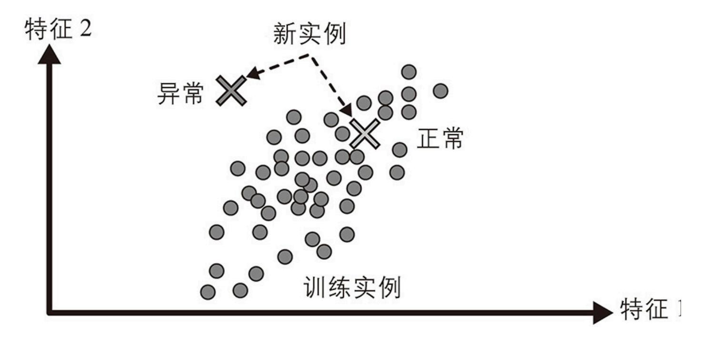

图1-10:异常检测

最后,还有⼀个常⻅的⽆监督任务是关联规则学习,其⽬标是挖掘⼤量数据并发现属性之间有趣的 关系。例如,假设你开了⼀家超市,在销售⽇志上运⾏关联规则可能会发现购买烧烤酱和薯⽚的⼈ 也倾向于购买⽜排。因此,你可能希望将这⼏样商品摆放得更近⼀些。

## 半监督学习

由于标记数据通常既耗时⼜昂贵,因此你通常会有很多未标记的实例⽽很少有已标记的实例。⼀些 算法可以处理⼀部分已标记的数据。这称为半监督学习(⻅图1-11)。

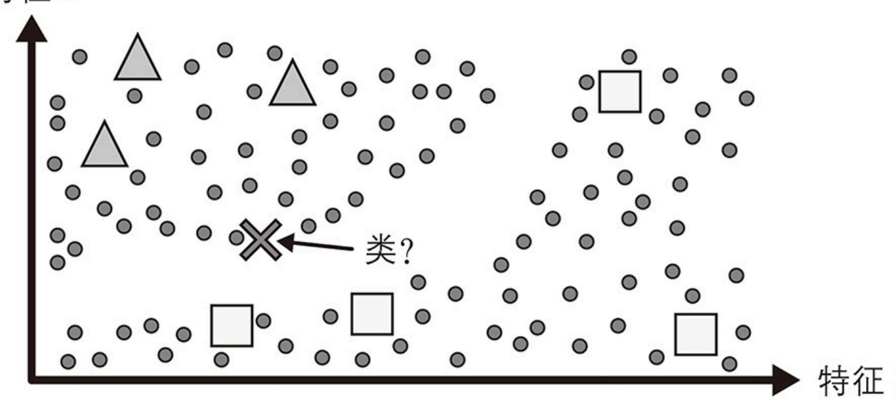

图1-11:具有两个类别(三⻆形和正⽅形)的半监督学习⸺未标记的样例(圆形)有助于将新实 例(⼗字)分类到三⻆形⽽不是正⽅形,即使它更接近标记的正⽅形

这就是系统运⾏良好的情况。在实践中,它通常会为每个⼈创建⼏个集群,有时会将两个看起来相 似的⼈混合在⼀起,因此你可能需要为每个⼈提供⼀些标签并⼿动清理⼀些集群。

⼀些照⽚托管服务(例如Google相册)就是很好的示例。⼀旦你将所有的家庭照⽚上传到该服 务,它会⾃动识别出同⼀个⼈A出现在照⽚1、5和11中,⽽另⼀个⼈B出现在照⽚2、5和7中。这是 算法(聚类)的⽆监督部分。现在系统只需要你告诉它这些⼈是谁。你只需为每个⼈添加⼀个标签 ,系统就可以为每张照⽚中的每个⼈命名,这对于搜索照⽚⾮常有⽤。

⼤多数半监督学习算法是⽆监督和监督算法的组合。例如,可以使⽤聚类算法将相似的实例分组在 ⼀起,然后每个未标记的实例都可以⽤其集群中最常⻅的标签进⾏标记。⼀旦标记了整个数据集, 就可以使⽤任何监督学习算法。

## ⾃监督学习

机器学习的另⼀种⽅法可以是从完全未标记的数据集⽣成完全标记的数据集。同样,⼀旦标记了整 个数据集,就可以使⽤任何监督学习算法。这种⽅法称为⾃监督学习。

例如,如果你有⼀个很⼤的未标记图像数据集,你可以随机屏蔽每个图像的⼀⼩部分,然后训练⼀ 个模型来恢复出原始图像(⻅图1-12)。在训练期间,屏蔽的图像⽤作模型的输⼊,原始图像⽤作 标签。

⽣成的模型本身可能⾮常有⽤。例如,修复损坏的图像或从图⽚中删除不想要的对象。但通常情况 下,使⽤⾃监督学习训练的模型并不是你的最终⽬标。你通常需要针对稍微不同的任务(你真正关 ⼼的任务)来调整和微调模型。

图1-12:⾃监督学习⽰例⸺输⼊(左)和⽬标(右)

例如,假设你真正想要的是⼀个宠物分类模型:给定⼀张宠物的照⽚,模型会告诉你这只宠物属于 什么物种。如果你有⼤量未标记的宠物照⽚数据集,则可以先使⽤⾃监督学习来训练⼀个图像修复 模型。如果模型表现良好,则它应该能够区分不同的宠物种类:当它修复⼀张蒙着脸的猫的图像 时,它必须知道不要添加狗的脸。假设你的模型架构允许(⼤多数神经⽹络架构都允许),那么你 就可以调整模型,使它能预测宠物种类⽽不是修复图像。最后⼀步是在已标记的数据集上微调模 型:模型已经知道猫、狗和其他宠物的样⼦,因此只需要这个步骤,模型就可以学习它已知的物种 和我们期望从中得到的标签之间的映射。

将知识从⼀项任务转移到另⼀项任务称为迁移学习,它是当今机器学习中最重要的技术之⼀,尤其 是在使⽤深度神经⽹络(即由多层神经元组成的神经⽹络)时。我们将在第⼆部分详细讨论这⼀ 点。

有些⼈认为⾃监督学习是⽆监督学习的⼀部分,因为它处理的是未标记的数据集。但是 ⾃监督学 习在训练期间是使⽤(⽣成的)标签的,因此在这⽅⾯它更接近于监督学习。在处理聚类、降维或 异常检测等任务时,通常会使⽤术语"⽆监督学习",⽽⾃监督学习侧重于与监督学习相同的任务, 主要是分类和回归。简⽽⾔之,最好将⾃监督学习视为⼀个单独的类别。

#### 强化学习

强化学习是⼀种⾮常不同的"巨兽"。这个学习系统(在此上下⽂中称为智能体)可以观察环境,选 择和执⾏动作,并获得回报(或负回报形式的惩罚,⻅图1-13)。然后它必须⾃⾏学习什么是最好 的⽅法,称为策略,以便随着时间的推移获得最⼤的回报。策略定义了智能体在给定情况下应该选 择的动作。

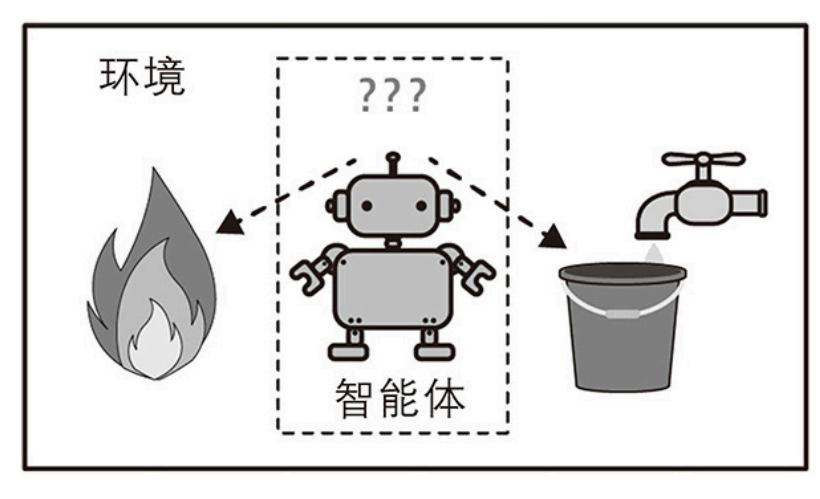

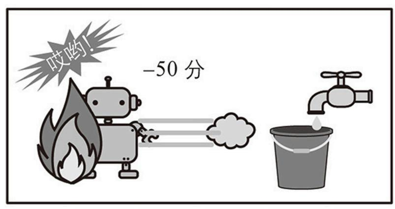

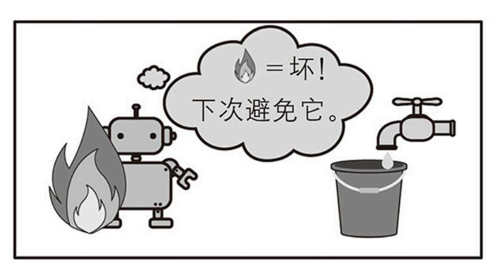

图1-13:强化学习

例如,许多机器⼈采⽤强化学习算法来学习如何⾛路。DeepMind的AlphaGo程序也是强化学习的 ⼀个很好的示例:它在2017年5⽉的围棋⽐赛中打败了当时世界排名第⼀的柯洁,成为头条新闻。 它通过分析数百万场⽐赛,然后与⾃⼰进⾏多次对弈,从⽽习得了获胜策略。请注意,在与⼈类冠 军的⽐赛中学习过程是被关闭的,AlphaGo只是在应⽤它学到的策略。正如你将在1.4.2节中看到 的,这称为离线学习。

## 1.4.2 批量学习与在线学习

对机器学习系统进⾏分类的另⼀个标准是系统能否从输⼊数据流中进⾏增量学习。

#### 批量学习

在批量学习中,系统⽆法进⾏增量学习:它必须使⽤所有可⽤的数据进⾏训练。这通常会占⽤⼤量 的时间和计算资源,因此通常需要离线完成。⾸先对系统进⾏训练,然后将其投⼊⽣产环境运⾏,

就不再学习了。它只是应⽤它学到的东⻄。这称为离线学习。

不幸的是,模型的性能往往会随着时间的推移⽽慢慢变差,因为世界在不断演进发展,⽽模型却保 持不变。这种现象通常称为模型腐烂或数据漂移。解决⽅案是定期根据最新的数据重新训练模型。 你需要多久做⼀次取决于⽤例:如果模型对猫和狗的图⽚进⾏分类,它的性能会衰减得很慢,但如 果模型处理快速变化的系统,例如对⾦融市场进⾏预测,那么它很可能会衰减得相当快。

即使是经过训练可以对猫和狗的图⽚进⾏分类的模型也可能需要定期重新训练,这不是因为猫和狗 会在⼀夜之间发⽣变化,⽽是因为相机会不断变化,图像格式、清晰度、亮度和⼤⼩⽐例也在不断 变化。此外,明年⼈们可能会喜欢不同的品种,或者他们可能会给宠物戴上⼩帽⼦,谁知道呢?

如果你想让批量学习系统理解新数据(⽐如新型垃圾邮件),你需要在完整数据集(不仅是新数 据,还有旧数据)上从头开始训练新版系统,然后⽤新模型替换旧模型。幸运的是,训练、评估和 启动机器学习系统的整个过程可以相当容易地⾃动化(⻅图1-3),因此即使是批量学习系统也可 以适应变化。只需要经常更新数据并从头开始训练新版系统。

这个解决⽅案很简单,⽽且通常效果很好,但使⽤完整数据集进⾏训练可能需要花费很多⼩时,因 此通常每24⼩时甚⾄每周训练⼀次新系统。如果你的系统需要适应快速变化的数据(例如,预测 股票价格),那么你需要⼀个更具反应性的解决⽅案。

此外,在完整的数据集上进⾏训练需要⼤量的计算资源(CPU、内存空间、磁盘空间、磁盘I/O、 ⽹络I/O等)。如果你有⼤量的数据,并且你让系统每天从头开始训练,那么最终会花费你很多 钱。如果数据量巨⼤,那么甚⾄可能⽆法使⽤批量学习算法。

最后,如果系统需要能够⾃动学习并且它的资源有限(例如,智能⼿机应⽤程序或⽕星上的漫游机 器⼈),那么携带⼤量训练数据并占⽤⼤量资源来每天训练数⼩时是不太可能的。

在这些情况下,更好的选择是使⽤能够增量学习的算法。

#### 在线学习

在在线学习中,通过以单独的数据或⼩批量的⼩组数据⽅式循序地向系统提供数据实例来对系统进 ⾏增量训练。每个学习步骤都既快速⼜便宜,因此系统可以即时学习新数据(⻅图1-14)。

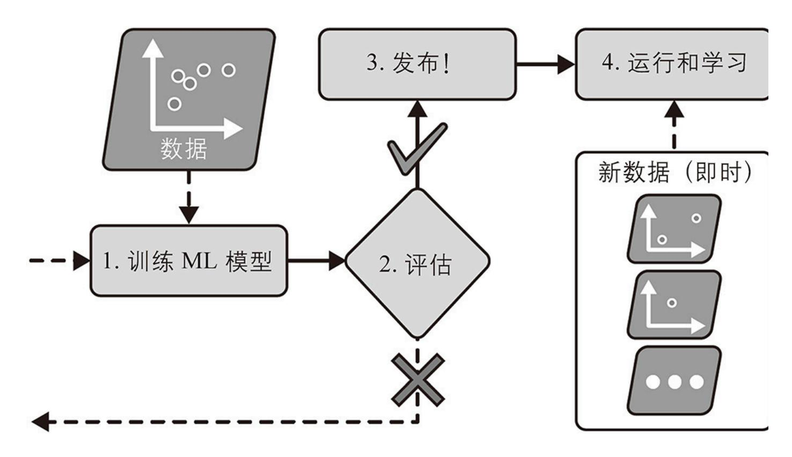

图1-14:在在线学习中,模型经过训练并投⼊⽣产环境,然后随着新数据的出现不断学习

在线学习对于需要快速适应变化的系统(例如,检测股票市场中的新模式)很有⽤。如果你的计算 资源有限,例如,模型是在移动设备上训练的,那么在线学习是⼀个不错的选择。

此外,对于超⼤数据集——超出⼀台计算机的主存储器所能容纳的数据,在线学习算法也同样适⽤ [这称为核外(out-of-core)学习]。该算法加载部分数据,在该数据上运⾏⼀个训练步骤,然后重 复该过程,直到它在所有数据上运⾏完(⻅图1-15)。

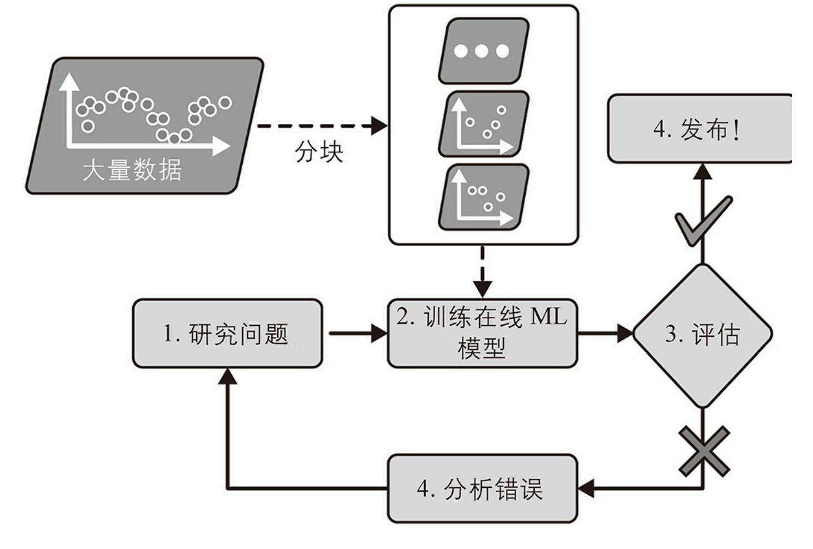

图1-15:使⽤在线学习来处理庞⼤的数据集

在线学习系统的⼀个重要参数是它们适应不断变化的数据的速度:这称为学习率。如果设置的学习 率很⾼,那么系统会快速适应新数据,但它也会很快忘记旧数据(并且你也不希望垃圾邮件过滤器 只标记最新类型的垃圾邮件)。反之,如果设置的学习率很低,那么系统会有更多的惰性,也就是 说,它会学习得更慢,但它对新数据中的噪声或⾮典型数据点(异常值)序列的敏感度也会降低。

核外学习通常是离线(即不在实时系统上)完成的,因此在线学习可能是⼀个容易混淆的名字。将 其视为增量学习会更合适。

在线学习的⼀⼤挑战是,如果将不良数据输⼊系统,系统的性能可能会迅速下降(取决于数据的质 量和学习率)。如果它是实时系统,那么你的客户会注意到这个现象。不良数据的来源可能是机器 ⼈的传感器故障,或者有⼈对搜索引擎恶意刷屏以提⾼搜索结果排名等。为降低这种⻛险,你需要 密切监控系统,并在检测到性能下降时⽴即关闭学习(并尽量恢复到之前的⼯作状态)。你可能还 想监控输⼊数据并对异常数据做出反应。例如,使⽤异常检测算法(⻅第9章)。

## 1.4.3 基于实例的学习与基于模型的学习

对机器学习系统进⾏分类的另⼀种⽅法是根据它们的泛化⽅式。⼤多数机器学习任务都与做出预测 有关。这意味着在给定⼤量训练样例的情况下,系统需要能够对它以前未⻅到过的样例做出良好的 预测(泛化)。在训练数据上有很好的性能是好的,但还不够,真正的⽬标是在新实例上表现良 好。

泛化⽅法主要有两种:基于实例的学习和基于模型的学习。

## 基于实例的学习

最司空⻅惯的学习⽅式可能就是简单地背诵。如果你以这种⽅式来创建垃圾邮件过滤器,那么它只 会标记所有与⽤户已标记的电⼦邮件相同的电⼦邮件——这虽然不是最坏的解决⽅案,但肯定不是 最好的。

垃圾邮件过滤器不仅可以标记与已知垃圾邮件相同的电⼦邮件,还可以对其进⾏编程来标 记与已 知垃圾邮件⾮常相似的电⼦邮件。这需要衡量两封电⼦邮件之间的相似性。两封电⼦邮件之间的 (⾮常基本的)相似性度量可以是计算它们共有的单词数。如果⼀封电⼦邮件与已知的垃圾邮件有 很多相同单词,那么系统会将其标记为垃圾邮件。

这称为基于实例的学习:系统⽤⼼学习样例,然后通过使⽤相似性度量将它们与学习到的样例(或 它们的⼦集)进⾏⽐较来泛化到新实例。例如,在图1-16中,新实例被归类为三⻆形,因为⼤多数 最相似的实例都属于该类。

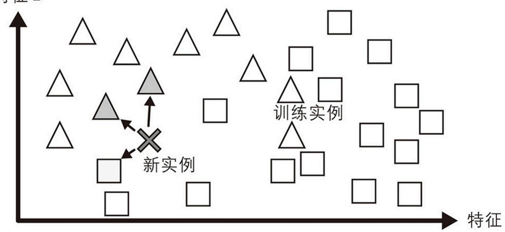

图1-16:基于实例的学习

#### 基于模型的学习和典型的机器学习⼯作流程

对⼀组样例进⾏泛化的另⼀种⽅法是为这些样例构建⼀个模型,然后使⽤该模型进⾏预测。这称为 基于模型的学习(⻅图1-17)。

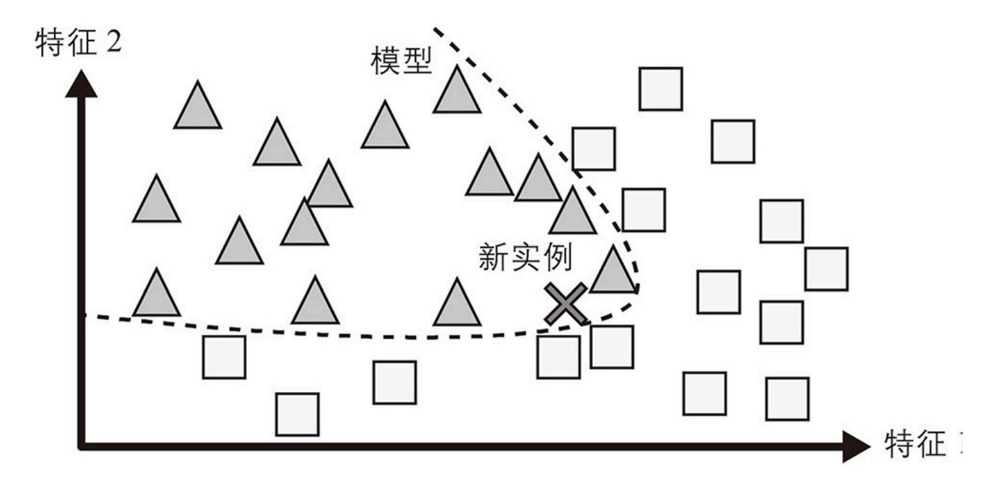

图1-17:基于模型的学习

例如,假设你想知道⾦钱是否能让⼈感到快乐,你可以从经合组织(OECD)⽹站 (https://www.oecdbetterlifeindex.org)下载⽣活幸福指数数据,再从世界银⾏ (https://ourworldindata.org)找到⼈均GDP(Gross Domestic Product)的统计数据,将数据 并⼊表格并按⼈均GDP排序。表1-1展示了你得到的内容的摘录。

表1-1:⾦钱能让⼈更快乐吗

| 国家   | 人均 GDP/ 美元 | 生活满意度 |
|------|------------|-------|
| 土耳其  | 28 384     | 5.5   |
| 匈牙利  | 31 008     | 5.6   |
| 法国   | 42 026     | 6.5   |
| 美国   | 60 236     | 6.9   |
| 新西兰  | 42 404     | 7.3   |
| 澳大利亚 | 48 698     | 7.3   |
| 丹麦   | 55 938     | 7.6   |

让我们绘制这些国家的数据(⻅图1-18)。

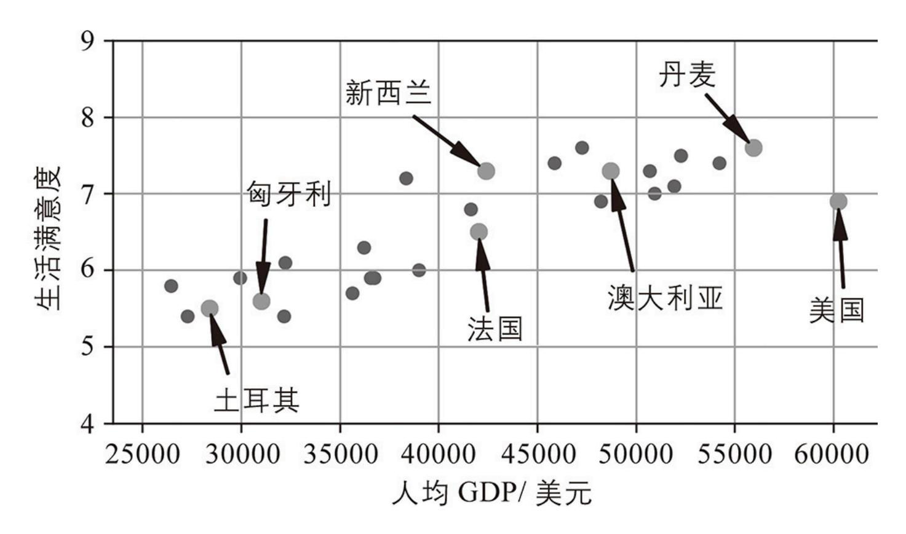

图1-18:你看到这⾥的趋势了吗

这⾥似乎确实有⼀种趋势!尽管数据有噪声(即部分随机),但看起来⽣活满意度随着国家⼈均 GDP的增⻓或多或少呈线性增⻓。因此,你决定将⽣活满意度建模为⼈均GDP的线性函数。这个 步骤称为模型选择:你选择了⼀个只有⼀个属性(即⼈均GDP)的⽣活满意度线性模型(⻅公式1- 1)。

#### 公式1-1:⼀个简单的线性模型

⽣活满意度=θ+θ×⼈均GDP

01

该模型有两个模型参数:θ和θ。通过调整这些参数,你可以⽤这个模型表示任何线性函数,如图1- 19所示。

按照惯例,希腊字⺟θ(theta)通常⽤于表⽰模型参数。

01

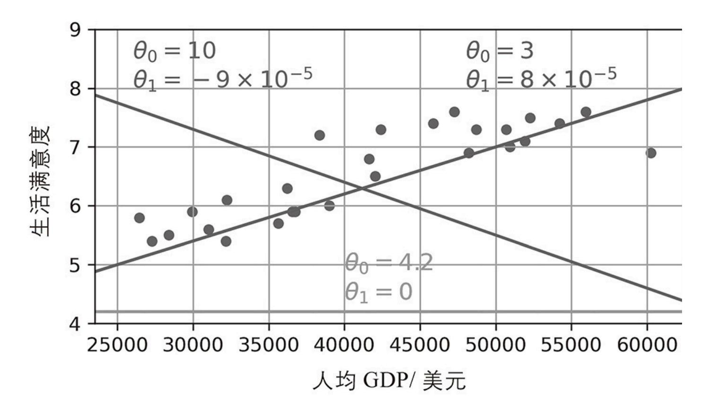

图1-19:⼀些可能的线性模型

在使⽤模型之前,你需要定义参数值θ和θ。你如何知道哪些值会使你的模型表现最好?要回答这个 问题,你需要指定⼀个性能指标。你可以定义⼀个效⽤函数(或拟合函数)来衡量模型有多好,也 可以定义⼀个代价函数来衡量模型有多差。对于线性回归问题,⼈们通常使⽤代价函数来衡量线性 模型的预测与训练样例之间的差距,⽬的在于最⼩化这个差距。

01

这就是线性回归算法的⽤武之地:通过你提供的训练样例,找到使线性模型最拟合你的数据的参 数。这称为训练模型。在我们的示例中,算法发现最佳参数值为θ=3.75和θ=6.78×10 -5。

01

令⼈困惑的是,"模型"⼀词可以指代模型的⼀种类型(例如,线性回归),也可以指代完全特定的 模型架构(例如,有⼀个输⼊和⼀个输出的线性回归),或者指代最后准备⽤于预测的已训练模型 (例如,有⼀个输⼊和⼀个输出的线性回归,参数为θ=3.75和θ=6.78×10 -5)。模型选择包括选择 模型类型和完全指定其架构。训练模型意味着运⾏算法来找到最拟合训练数据的模型参数,并希望 对新数据做出良好的预测。

01

现在(对于线性模型⽽⾔)模型最拟合训练数据,如图1-20所示。

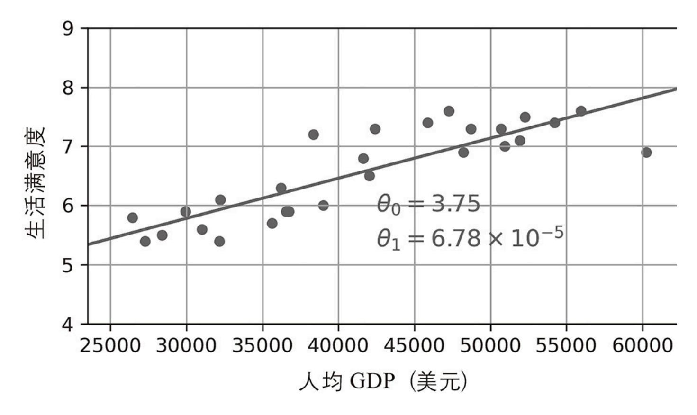

图1-20:最拟合训练数据的线性模型

现在终于可以运⾏模型进⾏预测了。例如,假设你想知道塞浦路斯⼈有多幸福,⽽经合组织的数据 没有答案。幸运的是,你可以使⽤这个模型做出很好的预测:先查看塞浦路斯的⼈均GDP是多少, 发现是37655美元,然后应⽤这个模型,发现⽣活满意度⼤约为3.75+37655×6.78×10 -5=6.30。

如果你还没有看懂所有的代码也没关系,我将在以下各章中介绍Scikit-Learn。

为了激发你的兴趣,示例1-1展示了加载数据的Python代码,将输⼊X与标签y分开,创建可视化散 点图,然后训练线性模型并进⾏预测 。

示例1-1:使⽤Scikit-Learn训练并运⾏⼀个线性模型

如果你改⽤基于实例的学习算法,你会发现以⾊列的⼈均GDP最接近塞浦路斯(38341美元),并 且由于经合组织数据告诉我们以⾊列⼈的⽣活满意度为7.2,你会预测塞浦路斯的⽣活满意度为 7.2。如果你稍微拉远⼀些,看看距离很近的两个国家,你会发现⽴陶宛和斯洛⽂尼亚这两个国家 的⽣活满意度都是5.9。对这三个值求平均值,得到6.33,这⾮常接近基于模型的预测。这个简单 的算法称为k近邻回归(在本例中,k=3)。

在上述代码中,⽤k近邻回归替换线性回归模型⾮常简单,只需将如下代码:

#### 替换为:

如果⼀切顺利,你的模型会做出很好的预测。如果不是,那么你可能需要使⽤更多的属性(就业 率、健康、空⽓污染等),获得更多或更⾼质量的训练数据,或者选择更强⼤的模型(例如,多项 式回归模型)。

#### 总之:

- ·研究数据。
- ·选择⼀个模型。
- ·使⽤训练数据进⾏训练(即学习算法搜索最⼩化代价函数的模型参数值)。
- ·最后,应⽤该模型对新实例进⾏预测(这称为推断),希望该模型能够被很好地泛化。

这就是⼀个典型的机器学习项⽬。在第2章中,你将通过从头到尾完成⼀个项⽬来亲身体验这⼀ 点。

到⽬前为⽌,我们已经介绍了很多基础知识:你现在知道了机器学习的真正含义,它为什么有⽤, ⼀些最常⻅的ML系统类别是什么,以及典型的项⽬⼯作流是什么样的。现在让我们看看在学习过 程中会遇到哪些妨碍你做出准确预测的问题。

## 1.5 机器学习的主要挑战

简⽽⾔之,由于你的主要任务是选择⼀个模型并在⼀些数据上对其进⾏训练,因此可能出现问题的 不外乎是"不良模型"和"不良数据"。让我们先从不良数据开始。

#### 1.5.1 训练数据量不⾜

要让⽛⽛学语的孩⼦了解什么是苹果,你只需指着⼀个苹果说"苹果"(可能需要重复此过程很多 次)就⾏了,然后孩⼦就能够识别出各种颜⾊和形状的苹果,简直是天才!

机器学习还没达到这⼀步,⼤多数机器学习算法需要⼤量数据才能正常⼯作。即使对于⾮常简单的 问题,你通常也需要成千上万个样例,⽽对于图像或语⾳识别等复杂问题,你可能需要数百万个样 例(除⾮你可以重⽤现有模型的某些部分)。

## 数据的不合理有效性

例如,根据上下⽂知道应该写"to""two"还是"too"。

在2001年发表的⼀篇著名论⽂(https://homl.info/6)中,微软研究员Michele Banko和Eric Brill 表明,给定⾜够的数据,截然不同的机器学习算法(包括相当简单的算法)在⾃然语⾔消歧 [的](#page-23-0)复 杂问题上表现⼏乎完全相同(如图1-21所示)。

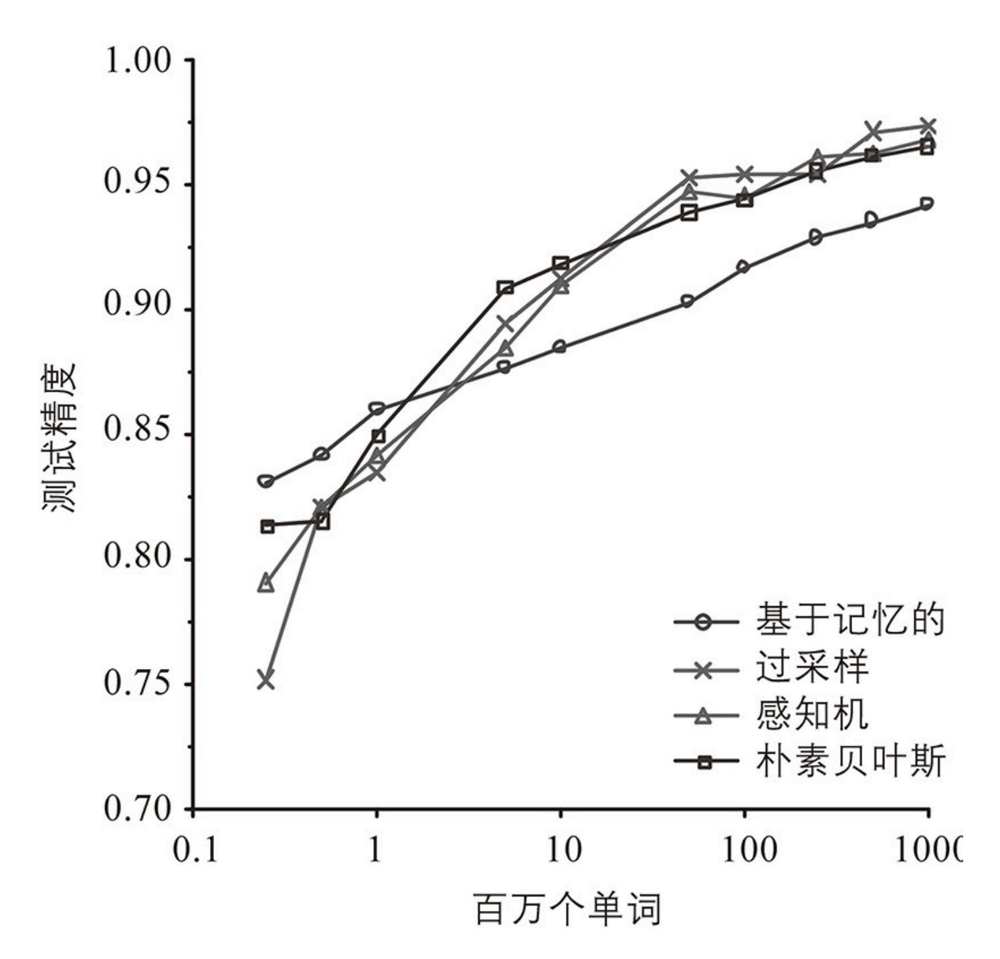

图经Michele Banko和Eric Brill许可转载,"Scaling to Very Very Large Corpora for Natural Language Disambiguation",Proceedings of the th Annual Meeting of the Association for Computational Linguistics (2001):26-33。

# 图1-21:数据与算法的重要性

正如作者所说:"这些结果表明我们可能需要重新思考如何在⼆者之间做权衡——将钱和时间花在 算法开发上,还是花在语料库开发上"。

Peter Norvig et al.,"The Unreasonable Effectiveness of Data",IEEE Intelligent Systems ,no. (2009):8-12.

对复杂问题⽽⾔数据⽐算法更重要,这⼀想法被Peter Norvig等⼈进⼀步推⼴,于2009发表了题 为"The Unreasonable Effectiveness of Data"(https://homl.info/7)的论⽂ 。需要注意的

是,中⼩型数据集仍然很普遍,获得额外的训练数据并不总是⼀件轻⽽易举或物美价廉的事情,所 以暂时不要抛弃算法。

#### 1.5.2 训练数据不具代表性

为了很好地实现泛化,训练数据必须能代表你想要泛化的新样例,这⼀点⾄关重要。

⽆论你使⽤基于实例的学习还是基于模型的学习,都是如此。

例如,你之前⽤于训练线性模型的国家数据集并不完全具有代表性,它不包含任何⼈均GDP低于 23500美元或⾼于62500美元的国家。图1-22展示了添加这些国家信息之后的数据表现。

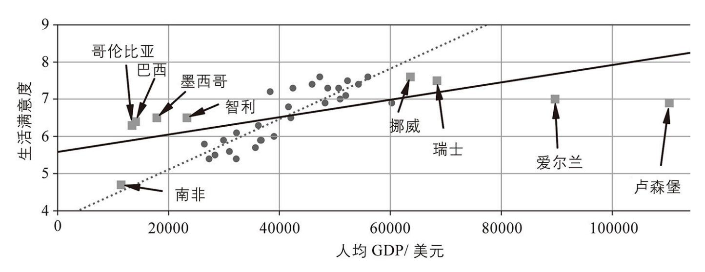

图1-22:更具代表性的训练样本

如果你在这个数据上训练⼀个线性模型,你会得到图1-22中的实线,旧模型⽤虚线表示。如你所 ⻅,添加了⼀些缺失的国家信息不仅显著地改变了模型,⽽且清楚地表明这种简单的线性模型可能 永远不会那么准确。似乎⾮常富裕的国家并不⽐中等富裕国家更幸福(事实上,似乎稍微有点不幸 福!),相反,⼀些贫穷国家似乎⽐许多富裕国家更幸福。

通过使⽤不具代表性的训练集,你训练了⼀个不太可能做出准确预测的模型,尤其是对于那些⾮常 贫穷和⾮常富裕的国家。

使⽤代表你要泛化到的实例的训练集⾄关重要。不过说起来容易,做起来难:如果样本太⼩,那么 会出现采样噪声(即⾮代表性数据被选中),但如果采样⽅法有缺陷,即使是⾮常⼤的样本也可能 不具有代表性。这称为采样偏差。

## 采样偏差的示例

也许最著名的采样偏差示例发⽣在1936年美国总统⼤选期间,当时兰登与罗斯福展开较量: Literary Digest当时举⾏了⼀次⾮常⼤的⺠意调查,向⼤约1000万⼈发送邮件,并得到了240万个 回复。因此做出了⾼度⾃信的预测——兰登将获得57%的选票。结果恰恰相反,罗斯福以62%的 选票获胜。问题就在于Literary Digest的采样⽅法:

·⾸先,为了获得⺠意调查的地址,Literary Digest使⽤了电话簿、杂志订阅名单、俱乐部会员名 单等。⽽所有这些名单上的⼈往往都是更富裕的⼈,他们更有可能投票给共和党⼈(兰登)。

·其次,只有不到25%的受访者做出了回答。这⼜⼀次引⼊了采样偏差,可能会排除不太关⼼政治 的⼈、不喜欢Literary Digest的⼈和其他关键的群体。这是⼀种特殊类型的采样偏差,称为⽆反应 偏差。

再举⼀个示例,假设你想建⽴⼀个系统来识别funk⾳乐视频。构建训练集的⼀种⽅法是在YouTube 上搜索"funk music"并使⽤搜索到的视频。但这假定YouTube的搜索引擎返回⼀组代表YouTube 上所有funk⾳乐视频的视频。实际上,搜索结果很可能偏向于流⾏艺术家(如果你住在巴⻄,你会 看到很多"funk carioca"的视频,听起来⼀点也不像James Brown)。另外,你还能如何获得⼀个 ⼤型训练集?

### 1.5.3 低质量数据

显然,如果你的训练数据充满错误、异常值和噪声(例如,低质量的测量产⽣的数据),系统将更 难检测到底层模式,也就更不太可能表现良好。花时间清洗训练数据通常是⾮常值得的。事实上, ⼤多数数据科学家都会花费⼤量时间做这项⼯作。例如:

- ·如果某些实例明显异常,则简单地丢弃它们或尝试⼿动修复错误可能会有所帮助。
- ·如果某些实例缺少⼀些特征(例如,5%的客户没有说明⾃⼰的年龄),你必须决定是完全忽略此 属性、忽略这些实例、将缺失值补充完整(例如,填写年龄的中位数),还是训练⼀个具有该特征 的模型,再训练⼀个没有该特征的模型。

## 1.5.4 ⽆关特征

俗话说:垃圾进,垃圾出。只有当训练数据包含⾜够多的相关特征并且没有太多⽆关特征时,系统 才能够进⾏学习。机器学习项⽬成功的⼀个关键部分是提取出好的特征集来进⾏训练。这个过程称 为特征⼯程,包括以下步骤:

- ·特征选择(在现有特征中选择最有⽤的特征进⾏训练)。
- ·特征提取(结合现有特征产⽣更有⽤的特征,正如我们之前看到的,降维算法可以提供帮助)。
- ·通过收集新数据创建新特征。

现在我们已经看了不少不良数据的示例,下⾯来看⼏个不良算法的示例。

#### 1.5.5 过拟合训练数据

假设你正在国外旅游,被出租⻋司机敲诈。你可能会说那个国家的所有出租⻋司机都是⼩偷。以偏 概全是我们⼈类常做的事情,不幸的是,如果我们不⼩⼼,机器也会落⼊同样的陷阱。在机器学习 中,这称为过拟合,也就是指该模型在训练数据上表现良好,但泛化效果不佳。

图1-23展示了严重过拟合训练数据的⾼阶多项式⽣活满意度模型。虽然它在训练数据上的表现⽐ 简单的线性模型好得多,但你真的相信它的预测吗?

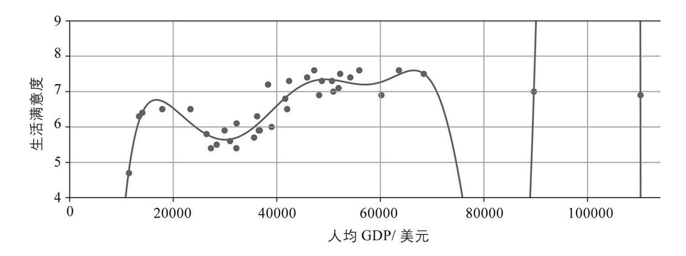

图1-23:过拟合训练数据

虽然诸如深度神经⽹络这类的复杂模型可以检测数据中的细微模式,但如果训练集有噪声,或者数 据集太⼩(引⼊了采样噪声),那么模型很可能会检测到噪声本身的模式(如出租⻋司机示例中那 样)。显然,这些模式不会泛化到新实例。例如,假设你为⽣活满意度模型提供了更多属性,包括 国家名称等⽆关属性。在这种情况下,⼀个复杂的模型可能会检测到⼀些模式,例如训练数据的名 称中带有⼀个字⺟w的所有国家的⽣活满意度都⼤于7:新⻄兰(New Zealand,7.3)、挪威 (Norway,7.6)、瑞典(Sweden,7.3)和瑞⼠(Switzerland,7.5)。你对w满意度规则泛化 到卢旺达或津巴布⻙有多⼤信⼼呢?显然,这种模式出现在训练数据中纯属偶然,但模型⽆法判断 这种模式是真实的还是噪声产⽣的结果。

当模型相对于训练数据的数量和噪声过于复杂时,就会发⽣过拟合。以下是可能的解决⽅案:

- ·通过选择参数较少的模型(例如,线性模型⽽不是⾼阶多项式模型)、减少训练数据中的属性数 量或约束模型来简化模型。
- ·收集更多训练数据。
- ·减少训练数据中的噪声(例如,修复数据错误并移除异常值)。

通过约束模型使它更简单,并降低过拟合的⻛险,这个过程称为正则化。例如,我们之前定义的线 性模型有两个参数:θ和θ。因此,该学习算法有两个⾃由度来调整模型使其适应训练数据,它可以 调整直线的⾼度(θ)和斜率(θ)。如果我们强制θ=0,该算法只有⼀个⾃由度,并且会更难正确 地拟合数据:它所能做的就是向上或向下移动线以尽可能接近训练实例,所以它最终会在平均值附 近。这确实是⼀个⾮常简单的模型!如果我们允许算法修改θ,但强制它保持较⼩的值,那么该学 习算法的⾃由度将在1到2之间。它⽣成的模型会⽐有两个⾃由度的模型更简单,但⽐只有⼀个⾃由 度的模型要复杂⼀些。你希望在完美拟合训练数据和保持模型⾜够简单之间找到适当的平衡点,以 确保模型能够较好地泛化。

010111

图1-24展示了三种模型。点线表示在以圆形表示的国家(没有以正⽅形表示的国家)上训练的原 始模型,实线是我们⽤所有国家(圆形和正⽅形)训练的第⼆个模型,虚线是⽤与第⼀个模型相同 的数据训练的模型,但是有正则化约束。你可以看到正则化强制了模型的斜率较⼩:该模型与训练 数据(圆形)的拟合不如第⼀个模型那么好,但它实际上可以更好地泛化到训练期间没看到过的新 样例(正⽅形)。

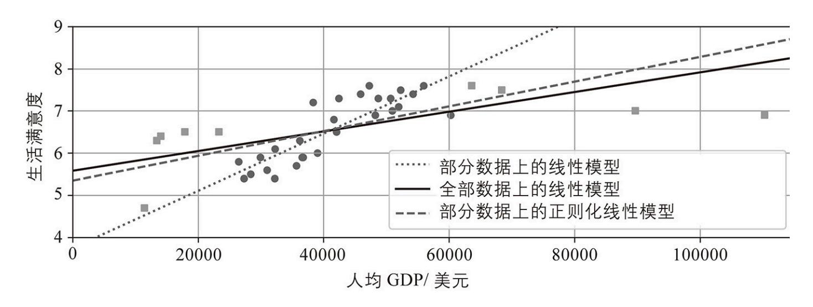

图1-24:正则化降低了过拟合的⻛险

学习期间应⽤的正则化程度可以由超参数控制。超参数是学习算法(⽽⾮模型)的参数。因此,它 不受学习算法本身的影响,必须在训练前设置并在训练期间保持不变。如果将正则化超参数设置得 ⾮常⼤,你将得到⼀个⼏乎平坦的模型(斜率接近于零)。学习算法虽然肯定不会过拟合训练数 据,但也不太可能找到好的解决⽅案。调整超参数是构建机器学习系统的重要部分(你将在第2章 中看到详细示例)。

## 1.5.6 ⽋拟合训练数据

你可能已经猜到了,⽋拟合与过拟合正好相反:当模型太简单⽽⽆法学习数据的底层结构时,就会 发⽣⽋拟合。例如,⽣活满意度的线性模型容易出现⽋拟合。因为现实情况总是⽐模型更复杂,所 以它的预测必然是不准确的,即使是在训练样例上也是如此。

### 以下是解决此问题的主要⽅式:

- ·选择具有更多参数的更强⼤的模型。
- ·为学习算法提供更好的特征(特征⼯程)。
- ·减少对模型的约束(例如通过减少正则化超参数)。

#### 1.5.7 退后⼀步

到⽬前为⽌,你对机器学习有了⼀定了解。但是,我们介绍了太多的概念,你可能会感到有点迷 茫,所以我们暂且退后⼀步,纵观⼀下全局:

- ·机器学习是关于如何让机器更好地完成某些任务的理论,它从数据中学习⽽⽆须清晰地编写规 则。
- ·机器学习系统有许多类型:有监督和⽆监督,批量的和在线的,基于实例的和基于模型的。

·在机器学习项⽬中,你从训练集中收集数据,然后将训练集提供给学习算法。如果该算法是基于 模型的,它会调整⼀些参数以使模型拟合训练集(对训练集本身做出良好的预测),然后希望它也 能够对新实例做出良好的预测。如果该算法是基于实例的,那么它会记住样例,并根据相似性度量 将它们与学习过的实例进⾏⽐较,从⽽泛化到新实例。

·如果训练集太⼩,或者数据不具有代表性、有噪声或被不相关的特征(垃圾进、垃圾出)污染, 那么系统的表现不会很好。最后,你的模型既不能太简单(这种情况会导致⽋拟合)也不能太复杂 (这种情况会导致过拟合)。

还有最后⼀个要介绍的重要主题:⼀旦训练了⼀个模型,你就不能只是"希望"它泛化到新实例,你 还需要评估它并在必要时对其进⾏微调。让我们看看如何做到这⼀点。

## 1.6 测试和验证

了解模型对新实例的泛化能⼒的唯⼀⽅法是在新实例上进⾏实际尝试。⼀种⽅法是将模型部署到⽣ 产环境并监控其性能。这种⽅法很有效,但如果模型⾮常糟糕,你的⽤户就会抱怨,所以这显然不 是最好的⽅法。

更好的选择是将数据分成两组:训练集和测试集。顾名思义,你可以使⽤训练集训练模型,并使⽤ 测试集对其进⾏测试。新实例的错误率称为泛化误差(或样本外误差),通过在测试集上评估模 型,你可以获得误差的估计值。这个值能告诉你模型在处理以前从未⻅过的实例时的表现。

如果训练误差很低(即模型在训练集上犯的错误很少)但是泛化误差很⾼,这意味着你的模型过拟 合了训练数据。

通常使⽤80%的数据进⾏训练,保留20%的数据进⾏测试。然⽽,这取决于数据集的⼤⼩:如果 它包含1000万个实例,那么保留1%意味着你的测试集将包含10万个实例,这可能⾜以很好地估计 泛化误差。

### 1.6.1 超参数调整和模型选择

评估模型⾮常简单:只需使⽤⼀个测试集。现在假设你在两种类型的模型(⽐如线性模型和多项式 模型)之间犹豫不决,你如何做出判断呢?⼀种选择是同时训练这两个模型,并使⽤测试集⽐较它 们的泛化能⼒。

现在假设线性模型泛化得更好,但你想应⽤⼀些正则化来避免过拟合。问题是,你如何选择正则化 超参数的值?⼀种选择是对于这个超参数,使⽤100个不同的值来训练100个不同的模型。假设你 找到了最佳超参数值,它⽣成的模型泛化误差最⼩,⽐如只有5%的误差。你将此模型部署到⽣产 环境,但遗憾的是它的性能并不如预期,产⽣了15%的误差。到底发⽣了什么?

问题是你多次测量了测试集上的泛化误差,并且调整了模型和超参数来⽣成拟合那个测试集的最佳 模型。这意味着该模型不太可能在新数据上表现良好。

这个问题的⼀个常⻅解决⽅案称为保持验证(⻅图1-25):你只需保持训练集的⼀部分,以评估 ⼏个候选模型并选择最佳模型。新的保留集称为验证集(或开发集)。更具体地说,你可以在简化 的训练集(即完整训练集减去验证集)上训练具有各种超参数的多个模型,然后选择在验证集上表

现最佳的模型。在此保持验证过程之后,你在完整训练集(包括验证集)上训练最佳模型,这就是 你的最终模型。最后,你在测试集上评估这个最终模型以获得泛化误差的估计。

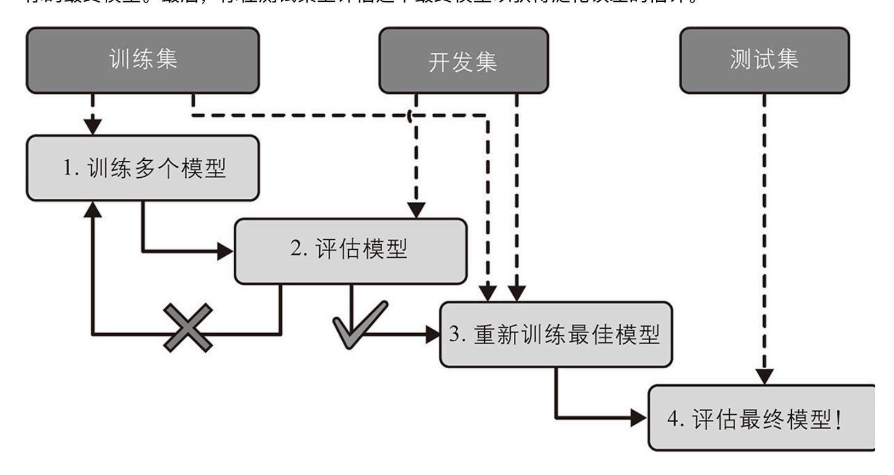

图1-25:使⽤保持验证的模型选择

这个解决⽅案通常效果很好。但是,如果验证集太⼩,则模型评估就不精确,你最终可能会错误地 选择⼀个次优模型。相反,如果验证集太⼤,那么剩余的训练集会⽐完整的训练集⼩得多。为什么 这样不好?好吧,由于最终模型是在完整的训练集上进⾏训练,因此在⼩得多的训练集上训练的候 选模型并不理想。这就像选择最快的短跑运动员去参加⻢拉松⽐赛。解决这个问题的⼀种⽅法是使 ⽤许多⼩的验证集执⾏重复的交叉验证。每个模型在对其余数据进⾏训练后,每个验证集都会评估 ⼀次。通过对模型的所有评估求平均,可以更准确地衡量其性能。然⽽,有⼀个缺点:训练时间是 验证集数量的倍数。

#### 1.6.2 数据不匹配

在某些情况下,很容易获得⼤量数据⽤于训练,但这些数据可能⽆法完全代表将在⽣产环境中使⽤ 的数据。例如,假设你想创建⼀个移动应⽤程序来拍摄花朵照⽚并⾃动确定它们的种类。你可以轻 松地在⽹络上下载数百万张花卉图⽚,但它们并不能完全代表在移动设备上使⽤该应⽤程序实际拍 摄的照⽚。也许你只有1000张有代表性的照⽚(即实际使⽤该应⽤程序拍摄的)。

在这种情况下,要记住的最重要的规则是验证集和测试集都必须尽可能地代表你希望在⽣产环境中 使⽤的数据,因此它们应该完全由有代表性的图⽚组成:你可以将它们打乱并将⼀半放在验证集 中,⼀半放在测试集中(确保两个集中都没有重复或接近重复)。在⽹络图⽚上训练了模型后,如 果你观察到模型在验证集上的表现令⼈失望,那么你将不知道这是因为模型对训练集过拟合了,还 是仅仅因为⽹络图⽚和移动应⽤程序图⽚之间的不匹配。

⼀种解决⽅案是将⼀些训练图⽚(来⾃⽹络)放在被吴恩达(Andrew Ng)称为train-dev(训练 开发)集(⻅图1-26)的另⼀个集合中。模型训练完成后(在训练集上,⽽不是在train-dev集 上),你可以在train-dev集上对其进⾏评估。如果模型表现不佳,那么它⼀定是对训练集过拟合 了,所以应该尽量简化或正则化该模型、获取更多的训练数据,以及清洗训练数据。但是如果模型 在train-dev集上表现良好,那么你可以在开发集上评估模型。如果模型表现不佳,那么问题⼀定 来⾃数据不匹配。你可以尝试通过预处理⽹络图⽚来解决这个问题,使它们看起来更像移动应⽤程 序拍摄的照⽚,然后重新训练模型。⼀旦你拥有在train-dev集和开发集上都表现良好的模型,就 可以在测试集上最后⼀次评估它,以了解它在⽣产环境中的表现。

图1-26:当真实数据稀缺时(右),你可以使⽤类似丰富的数据(左)进⾏训练,并在train-dev 集中保留⼀些数据以评估过拟合。然后使⽤真实数据评估数据不匹配(开发集)和最终模型的性能 (测试集)

## 没有免费的午餐定理

模型是数据的简化表示。简化旨在丢弃不太可能泛化到新实例的多余细节。当你选择特定类型的模 型时,你是在隐含地对数据做出假设。例如,如果你选择线性模型,则隐含地假设数据基本上是线 性的,并且实例与直线之间的距离只是噪声,可以安全地忽略它。

David Wolpert,"The Lack of A Priori Distinctions Between Learning Algorithms", Neural Computation ,no. (1996):1341-1390.

在1996年的⼀篇著名论⽂(https://homl.info/8) [中](#page-31-0),David Wolpert证明,如果你完全不对数 据做出任何假设,那么就没有理由偏爱某个模型。这被称为没有免费的午餐(No Free Lunch, NFL)定理。对于⼀些数据集,最好的模型是线性模型,⽽对于其他数据集,最好的模型是神经⽹ 络模型。不存在⼀个先验模型可以保证⼀定能更好地⼯作(这是定理名称的由来)。确定哪种模型 最好的唯⼀⽅法是对所有模型进⾏评估。由于这是不可能的,因此在实践中你对数据做出了⼀些合 理的假设并仅评估了⼏个合理的模型。例如,对于简单的任务,你可能只会评估⼏个具有不同正则 化⽔平的线性模型,⽽对于复杂的问题,你可能会评估多个神经⽹络模型。

# 1.7 练习题

在本章中,我们介绍了机器学习中⼀些最重要的概念。在接下来的⼏章中,我们将更深⼊地研究并 编写更多代码,但在此之前,请确保你可以回答以下问题:

- 1. 如何定义机器学习?
- 2. 机器学习在哪些问题上表现突出,你能说出四类应⽤吗?
- 3. 什么是被标记的训练集?
- 4. 最常⻅的两种监督学习任务是什么?

- 5. 你能说出四种常⻅的⽆监督学习任务吗?
- 6. 你会使⽤什么类型的算法让机器⼈在各种未知地形中⾏⾛?
- 7. 你会使⽤什么类型的算法将客户分成多个组?
- 8. 你会把垃圾邮件检测问题定义为监督学习问题还是⽆监督学习问题?
- 9. 什么是在线学习系统?
- 10. 什么是核外学习?
- 11. 什么类型的算法依赖于相似性度量来进⾏预测?
- 12. 模型参数和模型超参数有什么区别?
- 13. 基于模型的算法搜索什么?它们最常⽤的成功策略是什么?它们如何做出预测?
- 14. 你能说出机器学习中的四个主要挑战吗?
- 15. 如果你的模型在训练数据上表现很好,但对新实例的泛化能⼒很差,这是怎么回事?你能说出 三种可能的解决⽅案吗?
- 16. 什么是测试集?为什么要使⽤它?
- 17. 验证集的⽬的是什么?
- 18. 什么是train-dev集?什么时候需要它?如何使⽤?
- 19. 如果使⽤测试集来调整超参数会出现什么问题?

这些练习题的答案可在本章notebook的末尾找到,⽹址为https://homl.info/colab3。