#### 第2章

## 端到端机器学习项⽬

在本章中,将假设你是⼀家房地产公司最近聘请的数据科学家,完成⼀个端到端示例项⽬。这个示 例是虚构的,⽬标是说明机器学习项⽬的主要步骤,⽽不是学习有关房地产业务的任何知识。以下 是我们将要完成的主要步骤:

- 1. 放眼⼤局。
- 2. 获取数据。
- 3. 探索和可视化数据以获得⻅解。
- 4. 为机器学习算法准备数据。
- 5. 选择⼀个模型并训练它。
- 6. 微调模型。
- 7. 展示解决⽅案。
- 8. 发布、监控和维护系统。

## 2.1 使⽤真实数据

当你学习机器学习时,最好使⽤真实世界的数据⽽不是⼈⼯数据集进⾏实验。幸运的是,现在有数 以千计的开放数据集可供你选择,涵盖各个领域。你可以从以下⼏个地⽅获取数据:

- ·流⾏的开放数据存储库:
- ◆ OpenML.org(https://openml.org)
- ◆ Kaggle.com(https://kaggle.com/datasets)
- ◆ PapersWithCode.com(https://paperswithcode.com/datasets)
- ◆ UC Irvine Machine Learning Respository(https://archive.ics.uci.edu/ml)
- ◆ 亚⻢逊的AWS数据集(https://registry.opendata.aws)
- ◆ TensorFlow数据集(https://tensorflow.org/datasets)
- ·Meta portals(它们列出了开放数据存储库):
- ◆ DataPortals.org(https://dataportals.org)
- ◆ OpenDataMonitor.eu(https://opendatamonitor.eu)
- ·列出许多流⾏的开放数据存储库的其他⻚⾯:

- ◆ 维基百科的机器学习数据集列表(https://homl.info/9)
- ◆ Quora.com(https://homl.info/10)
- ◆ subreddit数据集(https://reddit.com/r/datasets)

<span id="page-1-0"></span>原始数据集由R. Kelley Pace和Ronald Barry提供,"Sparse Spatial Autoregressions", Statistics & Probability Letters ,no. (1997):291-297。

在本章中,我们将使⽤来⾃StatLib存储库的加州房价数据集(⻅图2-1) [。](#page-1-0)该数据集基于1990年 加州⼈⼝普查的数据。它并不是最新的数据(当时你还能负担得起⼀个湾区的好房⼦),但它有很 多可以学习的特性,所以我们假设它是最新的数据。出于教学⽬的,我添加了⼀个分类属性并删除 了⼀些特征。

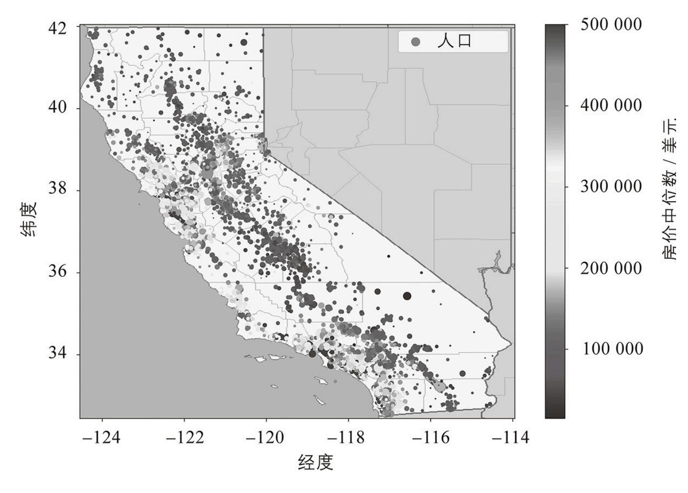

图2-1:加州房价

## 2.2 放眼⼤局

欢迎来到机器学习房产公司!你的⾸要任务是使⽤加州的⼈⼝普查数据构建该州的房价模型。该数 据包括加州每个街区组的⼈⼝、收⼊中位数和房价中位数等指标。街区组是美国⼈⼝普查局发布样 本数据的最⼩地理单位(⼀个街区组通常有600~3000⼈)。我将它们简称为"地区"。

你的模型应该从这些数据中学习,并能够在给定所有其他指标的情况下预测任何地区的房价中位 数。


由于你是⼀位井井有条的数据科学家,因此你应该做的第⼀件事就是拿出你的机器学习项⽬清单。 你可以从附录A中的那个开始;对于⼤多数机器学习项⽬,它应该可以⼯作得相当好,但请确保根 据你的需求进⾏调整。在本章中,我们将经历许多清单项⽬,但我们也会跳过⼀些,有些是因为它 们是不⾔⾃明的,有些是因为它们将在后⾯的章节中讨论。

## 2.2.1 框定问题

你问⽼板的第⼀个问题应该是业务⽬标到底是什么。建⽴模型可能不是最终⽬标。公司期望如何使 ⽤该模型并从中受益?了解⽬标很重要,因为它将决定你如何框定问题、你将选择哪些算法、你将 使⽤哪种性能指标来评估你的模型,以及你将花费多少精⼒来调整它。

馈送到机器学习系统的⼀条信息通常称为信号,参考了Claude Shannon的信息论,他在⻉尔实验 室开发了该理论以改善通信质量。他的理论是:你需要⼀个⾼信噪⽐。

⽼板回答说,你的模型的输出(对⼀个地区房价中位数的预测)将连同许多其他信息⼀起输⼊到另 ⼀个机器学习系统(⻅图2-2) 。这个下游系统将决定在给定的区域是否值得投资。做到这⼀点 ⾄关重要,因为它直接影响收⼊。

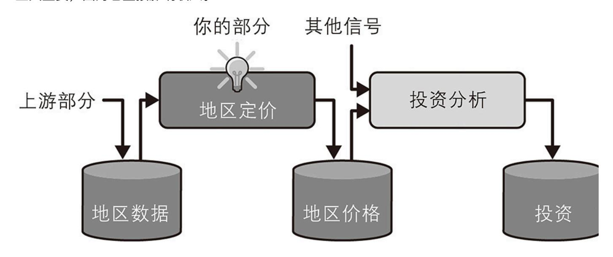

图2-2:⽤于房地产投资的机器学习流⽔线

下⼀个要问⽼板的问题是当前的解决⽅案是什么样的(如果有的话)。当前的情况往往会给你⼀个 绩效参考,以及如何解决问题的⻅解。你的⽼板回答说,地区房价⽬前是由专家⼿动估算的:⼀个 团队收集有关地区的最新信息,当他们⽆法得到房价中位数时,会使⽤复杂的规则进⾏估算。

这既费钱⼜费时,估算也不好。在设法找出实际房价中位数的情况下,他们通常会意识到估计偏差 会超过30%。这就是为什么公司认为,在给定有关该地区的其他数据的情况下,训练⼀个模型来 预测该地区的房价中位数会很有⽤。⼈⼝普查数据看起来是⼀个很好的数据集,可以⽤于此⽬的, 因为它包括数千个地区的房价中位数以及其他数据。

#### 流⽔线

⼀系列数据处理组件称为数据流⽔线。流⽔线在机器学习系统中⾮常常⻅,因为有⼤量数据需要操 作并且需要应⽤很多的数据转换。

组件通常是异步运⾏的。每个组件都会拉取⼤量数据,对其进⾏处理,然后将结果输出到另⼀个数 据存储器中。然后,⼀段时间后,流⽔线中的下⼀个组件拉取此数据并给出⾃⼰的输出。每个组件 都是相当独⽴的:组件之间的接⼝就是数据存储。这使得系统易于掌握(借助于数据流图),不同 的团队可以专注于不同的组件。此外,如果⼀个组件发⽣故障,下游组件通常可以仅使⽤损坏组件 的最后输出继续正常运⾏(⾄少⼀段时间)。这使得架构⾮常健壮。

另外,如果没有实施适当的监控,损坏的组件可能会在⼀段时间内被忽视。数据变得陈旧,整个系 统的性能会下降。

有了所有这些信息,你现在就可以开始设计你的系统了。⾸先,确定模型需要什么样的训练监督: 它是监督学习、⽆监督学习、半监督学习、⾃监督学习还是强化学习任务?它是分类任务、回归任 务还是其他任务?你应该使⽤批量学习还是在线学习技术?在继续阅读之前,请暂且先尝试⾃⼰回 答这些问题。

你找到答案了吗?让我们来看看。这显然是⼀个典型的监督学习任务,因为模型可以⽤已标记的样 例来进⾏训练(每个实例都有预期的输出,即该地区的房价中位数)。这是⼀个典型的回归任务, 因为模型被要求预测⼀个值。更具体地说,这是⼀个多元回归问题,因为系统使⽤多个特征进⾏预 测(地区⼈⼝、收⼊中位数等)。这也是⼀个单变量回归问题,因为我们只是试图预测每个地区的 单个值。如果我们试图预测每个地区的多个值,那将是⼀个多元回归问题。最后,没有连续的数据 流进⼊系统,所以没有特别需要来对快速变化的数据做调整,⽽且数据⾜够⼩,可以放在内存中, 所以普通的批量学习应该就能胜任。


如果数据量很⼤,你可以将批量学习⼯作拆分到多个服务器(使⽤MapReduce技术)或使⽤在线 学习技术。

#### 2.2.2 选择性能指标

下⼀步是选择性能指标。回归问题的典型性能度量是均⽅根误差(Root Mean Square Error, RMSE)。它给出了系统在其预测中通常会产⽣多⼤误差,并为较⼤的误差赋予较⾼的权重。公式 2-1显示了计算RMSE的数学公式。

## 公式2-1:均⽅根误差

RMSE(
$$X, h$$
) =  $\sqrt{\frac{1}{m} \sum_{i=1}^{m} (h(x^{(i)}) - y^{(i)})^2}$ 

#### 符号

这个公式引⼊了⼏个⾮常常⻅的机器学习符号,我将在本书中使⽤这些符号:

- ·m是你测量RMSE的数据集中的实例数。
- ◆ 例如,如果你在2000个地区的验证集上评估RMSE,则m=2000。

- ·x是数据集中第i个实例的所有特征值(不包括标签)的向量,y是它的标签(该实例的期望输出 值)。
- ◆ 例如,如果数据集中的第⼀个地区位于经度-118.29°,纬度33.91°,居⺠有1416⼈,收⼊中位数 为38372美元,房屋价值中位数为156400美元(暂时忽略其他特征),那么

$$\boldsymbol{x}^{(1)} = \begin{bmatrix} -118.29\\ 33.91\\ 1416\\ 38372 \end{bmatrix}$$

和

(1) y=156400

回想⼀下,转置运算符将列向量翻转为⾏向量(反之亦然)。

(i)⊤

- ·X是⼀个矩阵,包含数据集中所有实例的所有特征值(不包括标签)。每个实例有⼀⾏,第i⾏等 于x(i)的转置,记为(x))。
- ◆ 例如,如果第⼀个地区如前所述,则矩阵X如下所示:

$$X = \begin{pmatrix} (x^{(1)\top}) \\ (x^{(2)\top}) \\ \vdots \\ (x^{(1999)\top}) \\ (x^{(2000)\top}) \end{pmatrix} = \begin{pmatrix} -118.29 & 33.91 & 1416 & 38372 \\ \vdots & \vdots & \vdots & \vdots \end{pmatrix}$$

$$\hat{y}^{(i)} = h(\mathbf{x}^{(i)})$$

(i)

·h是系统的预测函数,也称为假设。当给系统⼀个实例的特征向量x时,它会输出该实例的预测 值。

$$\hat{y}^{(1)} = h(x^{(1)})_{\circ} = 158 \ 400 \ \hat{y}^{(1)} - y^{(1)} = 2000$$

- ◆ 例如,如果系统预测第⼀区的房价中位数为158400美元,则。该地区的预测误差为。
- ·RMSE(X,h)是使⽤假设h在样例集上测量的代价函数。

我们对标量值(例如m或y)和函数名称(例如h)使⽤⼩写斜体,对向量(例如x)使⽤⼩写粗斜 体,对矩阵(例如X)使⽤⼤写粗斜体。

虽然RMSE通常是回归任务的⾸选性能度量,但在某些情况下,你可能更喜欢使⽤其他函数。例 如,假设有很多异常地区。在这种情况下,你可以考虑使⽤平均绝对误差 (Mean Absolute Error,MAE,也称为平均绝对偏差),⻅公式2-2:

#### 公式2-2:平均绝对误差

MAE
$$(X, h) = \frac{1}{m} \sum_{i=1}^{m} |h(x^{(i)}) - y^{(i)}|$$

RMSE和MAE都是衡量两个向量(预测向量和⽬标向量)之间距离的⽅法。各种距离度量或范数是 可能的:

·计算平⽅和的根(RMSE)对应于欧⼏⾥得范数:这是我们都熟悉的距离概念。它也被称为ℓ范 数,记为‖·‖2(或简称为‖·‖)。

2

·计算绝对值之和(MAE)对应于ℓ范数,记为‖·‖1,这有时被称为曼哈顿范数,因为如果你只能沿 着正交的城市街区⾏动,那么它会测量城市中两点之间的距离。

1

$$||\mathbf{v}||_k = (|v_1|^k + |v_2|^k + \cdots + |v_n|^k)^{1/k}$$

·⼀般⽽⾔,包含n个元素的向量v的ℓk范数定义为。ℓ给出向量中的⾮零元素的数量,ℓ给出向量中 的最⼤绝对值。

0∞

范数指数越⾼,它就越关注⼤值⽽忽略⼩值。这就是RMSE⽐MAE对异常值更敏感的原因。但是当 异常值呈指数级减少时(例如在钟形曲线中),RMSE表现⾮常好,并且通常是⾸选。

#### 2.2.3 检查假设

最后,列出并验证到⽬前为⽌(由你或其他⼈)所做的假设是⼀种很好的做法。这可以帮助你尽早 发现严重的问题。例如,你的系统输出的地区价格被输⼊到下游的机器学习系统中,并且你假设这 些价格将被原样使⽤。但是,如果下游系统将价格转换为类别(例如,"便宜""中等"或"昂 贵"),然后使⽤这些类别⽽不是价格本身呢?在这种情况下,得到完全正确的价格根本不重要, 你的系统只需要获得正确的类别。如果是这样,那么问题应该被定义为分类任务,⽽不是回归任 务。你肯定不想在回归任务上⼯作⼏个⽉后才发现这⼀点。

幸运的是,在与负责下游系统的团队交谈后,你确信他们确实需要实际的价格,⽽不仅仅是类别。 很好!⼀切就绪,指示灯是绿灯,那现在可以开始编程了!

## 2.3 获取数据

是时候动⼿了。不要犹豫,拿起你的笔记本计算机并浏览代码示例。正如我在前⾔中提到的,本书 中的所有代码示例都是开源的,可以作为Jupyter notebook在线获取

(https://github.com/ageron/handson-ml3),它们是包含⽂本、图像和可执⾏代码⽚段的交 互式⽂档(在我们的示例中是Python)。在本书中,假设你在Google Colab上运⾏这些代码,这 是⼀项免费服务,可让你直接在线运⾏任何Jupyter notebook,⽽⽆须在你的机器上安装任何东 ⻄。如果你想使⽤其他在线平台(例如Kaggle),或者如果你想在⾃⼰的机器上本地安装所有内 容,请参阅本书的GitHub⻚⾯上的说明。

## 2.3.1 使⽤Google Colab运⾏代码示例

⾸先,打开⽹络浏览器并访问https://homl.info/colab3:这将带你进⼊Google Colab,它将显示 本书的Jupyter notebook列表(⻅图2-3)。你会发现每章有⼀个notebook,外加⼀些额外的 notebook以及NumPy、Matplotlib、Pandas、线性代数和微积分的教程。例如,如果你单击 02\_end\_to\_end\_machine\_learning\_project.ipynb,那么第2章中的notebook将在Google Colab 中打开(⻅图2-4)。

| Examples                            | Recent               | Google             | Drive | GitHub | Upl           | oad     |
|-------------------------------------|----------------------|--------------------|-------|--------|---------------|---------|
| Enter a GitHub URL or se            | arch by organizatio  | n or user          |       |        | nclude privat | te repo |
| ageron                              |                      |                    |       |        |               | _ Q     |
| Repository: 🗹<br>ageron/handson-ml3 |                      | ranch: 🔼<br>master | •     |        |               |         |
| Path                                |                      |                    |       |        |               |         |
| 01_the_machine_le                   | earning_landscape.ip | pynb               |       |        | ۵             |         |
| 02 end to end m                     | achine_learning_proj | <u>ect.ipynb</u>   |       |        | Q             | Ø       |
|                                     |                      |                    |       |        |               |         |
| O3_classification.i                 | pynb                 |                    |       |        | Q             | Ø       |

图2-3:Google Colab中的notebook列表

Jupyter notebook由单元格列表组成。每个单元格包含可执⾏代码或⽂本。尝试双击第⼀个⽂本单 元格(其中包含句⼦"Welcome to Machine Learning Housing Corp.!")。这将打开单元格进 ⾏编辑。请注意,Jupyter notebook使⽤Markdown语法进⾏格式化(例如,\*\*粗体\*\*、\*斜体\*、 #标题、[url](链接⽂本)等)。尝试修改此⽂本,然后按Shift-Enter查看结果。

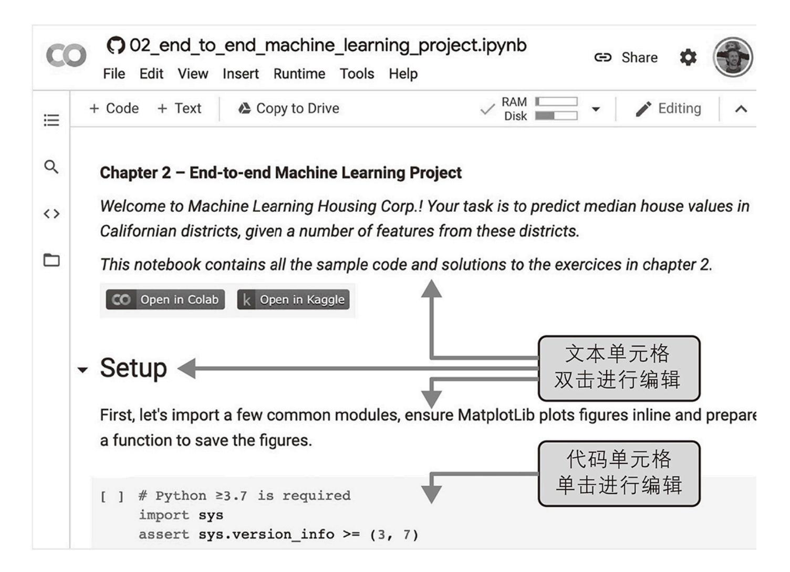

图2-4:你在Google Colab中的notebook

接下来,通过从菜单中选择Insert→"Code cell"来创建⼀个新的代码单元格。或者,你可以单击⼯ 具栏中的+Code按钮,或将⿏标悬停在单元格底部,直到看到+Code和+Text出现,然后单击 +Code。在新的代码单元格中,键⼊⼀些Python代码,例如print("Hello World"),然后按 Shift-Enter运⾏此代码(或单击单元格左侧的按钮)。

如果你尚未登录Google账户,则系统会要求你⽴即登录(如果你还没有Google账户,则需要创建 ⼀个)。登录后,当你尝试运⾏代码时,你会看到⼀条安全警告,告诉你此notebook不是由 Google创作的。⼀个恶意的⼈可能会创建⼀个notebook,试图诱骗你输⼊你的Google凭据,然后 就可以访问你的个⼈数据,因此在你运⾏notebook之前,请始终确保你信任其作者(在运⾏它之 前,仔细检查每个代码单元格将执⾏的操作)。假设你相信我(或者你计划检查每个代码单元 格),你现在可以单击"Run anyway"。

Colab然后会为你分配⼀个新的运⾏时:这是⼀个位于Google服务器上的免费虚拟机,其中包含⼀ 堆⼯具和Python库,包括本书⼤多数章节所需的⼀切(在某些章节中,你需要运⾏安装附加库的 命令)。这需要⼏秒钟。接下来,Colab将⾃动连接到此运⾏时并使⽤它来执⾏你的新代码单元。 重要的是,这些代码在运⾏时运⾏,⽽不是在你的机器上运⾏。代码的输出将显示在单元格下⽅。 恭喜,你已经在Colab上运⾏了⼀些Python代码!


要插⼊新的代码单元格,你还可以键⼊Ctrl-M(或macOS上的Cmd-M),然后键⼊A(在活动单 元格的上⽅插⼊)或B(在下⽅插⼊)。还有许多其他可⽤的键盘快捷键:你可以通过键⼊Ctrl-M (或Cmd-M)然后键⼊H来查看和编辑它们。如果你选择在Kaggle或你⾃⼰的机器上使⽤ JupyterLab或带有Jupyter扩展的Visual Studio Code等IDE来运⾏notebook,你会看到⼀些细微 差别——运⾏时称为内核,⽤户界⾯和键盘快捷键略有不同,等等——但是从⼀个Jupyter环境切 换到另⼀个环境并不难。

#### 2.3.2 保存你的代码更改和数据

你可以对Colab notebook进⾏更改,只要你保持浏览器选项卡打开,它们就会⼀直存在。但是⼀ 旦关闭它,所做的更改就会丢失。为避免这种情况,请确保通过选择

File→"Save a copy in Drive"将notebook的副本保存到你的Google Drive。或者,你可以通过选 择File→Download→"Download.ipynb"将notebook下载到你的计算机。然后你可以稍后访问 https://colab.research.google.com并再次打开notebook(从Google Drive或从你的计算机上 传)。


Google Colab仅供交互使⽤:你可以在notebook中随意调整代码,但不能让notebook⻓时间⽆⼈ 值守,否则运⾏时将关闭并且所有它的数据将丢失。

如果notebook⽣成了你关⼼的数据,请确保在运⾏时关闭之前下载此数据。为此,单击⽂件图标 (⻅图2-5中的步骤1),找到你要下载的⽂件,单击它旁边的垂直点(步骤2),然后单击下载 (步骤3)。或者,你可以将Google Drive挂载在运⾏时上,让notebook可以直接将⽂件读写到 Google Drive,就好像它是本地⽬录⼀样。为此,单击⽂件图标(第1步),然后单击 Google Drive图标(在图2-5中圈出)并按照屏幕上的说明进⾏操作。

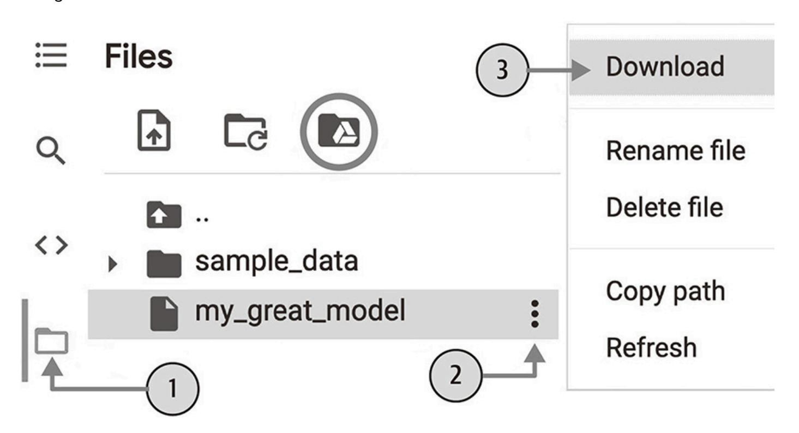

图2-5:从Google Colab运⾏时下载⽂件(第1步到第3步),或装载你的Google Drive(带圆圈 的图标)

默认情况下,你的Google Drive将安装在/content/drive/MyDrive。如果要备份数据⽂件,只需运 ⾏!cp/content/my\_great\_model/content/drive/MyDrive将其复制到此⽬录即可。任何以!开 头的命令都被视为shell命令,⽽不是Python代码。cp是Linux shell命令,⽤于将⽂件从⼀个路径复 制到另⼀个路径。请注意,Colab运⾏时在Linux(特别是Ubuntu)上运⾏。

## 2.3.3 交互性的⼒量和危险

Jupyter notebook是交互式的,这是⼀件很棒的事情:你可以⼀个⼀个地运⾏每个单元格、在任何 时候停⽌、插⼊⼀个单元格研究代码、返回并再次运⾏同⼀个单元格,等等。我强烈建议你这样 做。如果你只是⼀个⼀个地运⾏单元格⽽不去动⼿尝试它们,你就不会学得那么快。然⽽,这种灵 活性是有代价的:很容易以错误的顺序运⾏单元格,或者忘记运⾏⼀个单元格。如果发⽣这种情 况,后续的代码单元格很可能会失败。例如,每个notebook中的第⼀个代码单元格包含设置代码 (例如导⼊),因此请确保先运⾏它,否则所有单元格将⽆法运⾏。


如果遇到奇怪的错误,请尝试重新启动运⾏时(通过从菜单中选择 Runtime→"Restart runtime"),然后从notebook的开头再次运⾏所有单元格。这通常可以解决 问题。如果问题未解决,则可能是你所做的其中⼀项更改破坏了notebook:只需恢复到原始 notebook并重试。如果仍然失败,请在GitHub上提交问题。

#### 2.3.4 本书代码与notebook代码

有时你可能会注意到本书代码与notebook代码之间存在⼀些细微差别。发⽣这种情况可能有以下 ⼏种原因:

- ·当你阅读这些内容时,代码库可能已经发⽣了细微的变化,或者尽管我尽了最⼤的努⼒,但我还 是在书中犯了错误。可悲的是,我⽆法修复这本书中的代码(除⾮你正在阅读电⼦版并且你可以下 载最新版本),但我可以修复notebook。所以,如果你是从本书中复制代码后遇到错误,请在 notebook中查找修复的代码:我会努⼒保持它们没有错误并与最新的库版本保持同步。
- ·notebook中包含⼀些额外的代码来美化图形(添加标签、设置字体⼤⼩等)并为本书以⾼分辨率 来保存它们。如果你愿意,你可以安全地忽略这些额外的代码。

我优化了代码的可读性和简单性:我让它尽可能的保持线性和扁平,只定义很少的函数或类。⽬标 是确保你正在运⾏的代码通常就在你⾯前,⽽不是嵌套在你必须搜索的多个抽象层中。这也使你可 以更轻松地使⽤代码。为简单起⻅,错误处理的代码很有限,我将⼀些最不常⻅的导⼊放在需要的 地⽅(⽽不是按照PEP 8 Python样式指南的建议将它们放在⽂件顶部)。也就是说,你的⽣产环 境代码不会有太⼤的不同:只是更加模块化,并且具有额外的测试和错误处理。

好的!⼀旦你熟悉了Colab,就可以下载数据了。

#### 2.3.5 下载数据

你可能还需要检查法律约束,例如不应将私有字段复制到不安全的数据存储中。

在典型的环境中,你的数据在关系数据库或其他⼀些通⽤数据存储中,并分布在多个表/⽂档/⽂件 中。要访问它,你⾸先需要获得你的凭据和访问授权 ,并熟悉数据模式。然⽽,在这个项⽬中,

事情要简单得多:你只需下载⼀个压缩⽂件housing.tgz,其中包含⼀个名为housing.csv的逗号分 隔值(Comma-Separated Value,CSV)⽂件,其中包含所有数据。

与其⼿动下载和解压缩数据,不如编写⼀个函数来为你完成这些⼯作。这在数据定期更改时特别有 ⽤:你可以编写⼀个⼩脚本,使⽤该函数来获取最新数据(或者你可以设置⼀个计划作业来定期⾃ 动执⾏此操作)。如果你需要在多台机器上安装数据集,⾃动化获取数据的过程也很有⽤。

#### 这是获取和加载数据的函数:

调⽤load\_housing\_data()时,它会查找datasets/housing.tgz⽂件。如果找不到,它会在当前⽬录 (在Colab中默认为/content)中创建datasets⽬录,从ageron/data GitHub存储库下载 housing.tgz⽂件,并将其内容提取到datasets⽬录中。这将创建datasets/housing⽬录,其中包 含housing.csv⽂件。最后,该函数将此CSV⽂件加载到包含所有数据的Pandas DataFrame对象 中,并返回它。

#### 2.3.6 快速浏览数据结构

⾸先使⽤DataFrame的head()⽅法查看前5⾏数据(⻅图2-6)。

| housing.head() |           |          |                    |               |                 |                    |  |
|----------------|-----------|----------|--------------------|---------------|-----------------|--------------------|--|
|                | longitude | latitude | housing_median_age | median_income | ocean_proximity | median_house_value |  |
| 0              | -122.23   | 37.88    | 41.0               | 8.3252        | NEAR BAY        | 452600.0           |  |
| 1              | -122.22   | 37.86    | 21.0               | 8.3014        | NEAR BAY        | 358500.0           |  |
|                |           |          |                    |               |                 |                    |  |

图2-6:数据集中的前5⾏

每⼀⾏代表⼀个地区。有10个属性(图2-6中没有全部显示):longitude、latitude、

housing\_median\_age、total\_rooms、total\_bedrooms、population、households、median\_income、median\_house\_value 和ocean\_proximity。

info()⽅法对于获取数据的快速描述很有⽤,特别是总⾏数、每个属性的类型和⾮空值的数量:

| # | Column             | Non-Null Count | Dtype   |
|---|--------------------|----------------|---------|
|   |                    |                |         |
| 0 | longitude          | 20640 non-null | float64 |
| 1 | latitude           | 20640 non-null | float64 |
| 2 | housing_median_age | 20640 non-null | float64 |
| 3 | total_rooms        | 20640 non-null | float64 |
| 4 | total_bedrooms     | 20433 non-null | float64 |
| 5 | population         | 20640 non-null | float64 |
| 6 | households         | 20640 non-null | float64 |
| 7 | median_income      | 20640 non-null | float64 |
| 8 | median_house_value | 20640 non-null | float64 |
| 9 | ocean_proximity    | 20640 non-null | object  |
|   |                    |                |         |


在本书中,当代码示例包含代码和输出的混合时,就像这⾥的情况⼀样,它的格式与Python解释 器中的⼀样,以提⾼可读性:代码⾏以>>>为前缀(或... 缩进块),并且输出没有前缀。

数据集中有20640个实例,这意味着按照机器学习标准,它相当⼩,但⾮常适合⼊⻔。你注意到 total\_bedrooms属性只有20433个⾮空值,这意味着207个地区缺少此属性。你稍后需要处理这个问 题。

除了ocean\_proximity之外,所有属性都是数字的。它的类型是对象,所以它可以容纳任何类型的 Python对象。但是由于你是从CSV⽂件加载此数据的,所以你知道它⼀定是⽂本属性。当你查看 前五⾏时,你可能会注意到ocean\_proximity列中的值是重复的,这意味着它可能是⼀个分类属性。你 可以使⽤value\_counts()⽅法找出存在哪些类别以及每个类别有多少个地区:

让我们看看其他领域。describe()⽅法显示数字属性的摘要(⻅图2-7)。

|       | longitude    | latitude     | housing_median_age | total_rooms  | total_bedrooms | median_house_value |
|-------|--------------|--------------|--------------------|--------------|----------------|--------------------|
| count | 20640.000000 | 20640.000000 | 20640.000000       | 20640.000000 | 20433.000000   | 20640.000000       |
| mean  | -119.569704  | 35.631861    | 28.639486          | 2635.763081  | 537.870553     | 206855.816909      |
| std   | 2.003532     | 2.135952     | 12.585558          | 2181.615252  | 421.385070     | 115395.615874      |
| min   | -124.350000  | 32.540000    | 1.000000           | 2.000000     | 1.000000       | 14999.000000       |
| 25%   | -121.800000  | 33.930000    | 18.000000          | 1447.750000  | 296.000000     | 119600.000000      |
| 50%   | -118.490000  | 34.260000    | 29.000000          | 2127.000000  | 435.000000     | 179700.000000      |
| 75%   | -118.010000  | 37.710000    | 37.000000          | 3148.000000  | 647.000000     | 264725.000000      |
| max   | -114.310000  | 41.950000    | 52.000000          | 39320.000000 | 6445.000000    | 500001.000000      |

图2-7:每个数字属性的摘要

标准差⼀般表⽰为σ(希腊字⺟sigma),它是⽅差的平⽅根,即均值的平⽅差的平均值。当⼀个 特征具有常⻅的钟形正态分布(也称为⾼斯分布)时,"68-95-99.7"规则适⽤:⼤约68%的值落 在平均值的1σ范围内,95%的值在2σ范围内,99.7%的值在3σ范围内。

count、mean、min和max⾏是不⾔⾃明的。请注意,空值将被忽略(因此,例如,total\_bedrooms的计 数是20433,⽽不是20640)。std⾏显示标准差,标准差衡量值的分散程度 。25%、50%和75%⾏ 显示相应的百分位数:百分位数表示⼀组观察值中给定百分⽐的观察值低于该值。例如,25%的 地区housing\_median\_age低于18,50%低于29,75%低于37。这些通常称为第25个百分位数(或第⼀ 个四分位数)、中位数和第75个百分位数(或第三个四分位数)。

另⼀种快速了解你正在处理的数据类型的⽅法是为每个数值属性绘制直⽅图。直⽅图显示具有给定 值范围(在⽔平轴上)的实例数(在垂直轴上)。你可以⼀次绘制⼀个属性,也可以对整个数据集 调⽤hist()⽅法(如下⾯的代码示例所示),它会绘制每个数值属性的直⽅图(⻅图2-8):

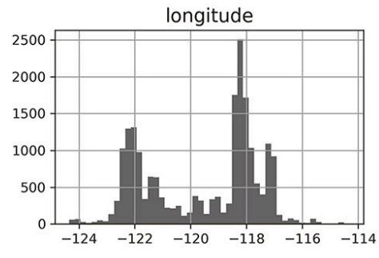

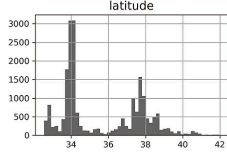

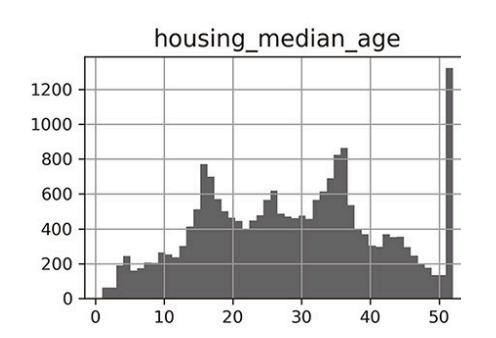

▲图2-8:每个数值属性的直⽅图

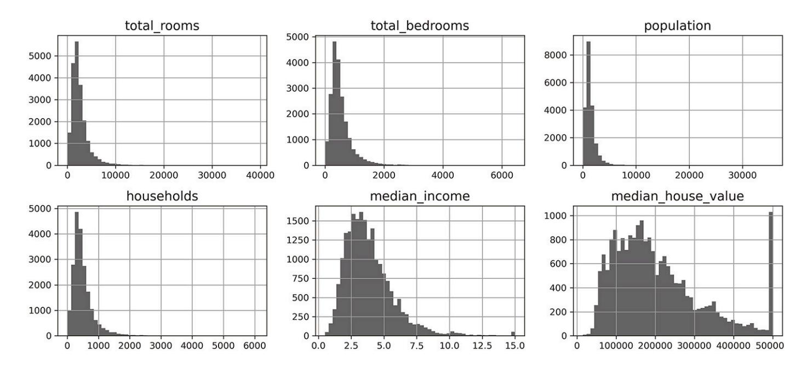

图2-8:每个数值属性的直⽅图(续)

#### 查看这些直⽅图,你会注意到⼀些事情:

- ·⾸先,收⼊中位数属性看起来不像是以美元表示的。在与收集数据的团队核实后,你被告知数据 已按⽐例缩放并上限为15(实际上是15.0001)以表示较⾼的收⼊中位数,以及0.5(实际上是 0.4999)以表示较低的收⼊中位数。这些数字⼤约代表万美元(例如,3实际上表示⼤约30000美 元)。使⽤预处理属性在机器学习中很常⻅,这不⼀定是个问题,但你应该了解数据是如何计算 的。
- ·房屋年龄中位数和房价中位数也有上限。后者可能是⼀个严重的问题,因为它是你的⽬标属性 (你的标签)。你的机器学习算法可能会学习到价格永远不会超过该限制。你需要与你的客户团队 (将使⽤你的系统输出的团队)确认这是否是⼀个问题。如果他们告诉你他们需要超过500000美 元的精确预测,那么你有两个选择:
- ◆ 为标签被封顶的地区收集适当的标签。
- ◆ 从训练集中删除这些地区(也从测试集中删除这些地区,因为如果系统预测值超过500000美 元,则不应该评估它不好)。
- ·这些属性具有⾮常不同的尺度。我们将在本章稍后探讨特征缩放时讨论这个问题。
- ·最后,许多直⽅图向右倾斜:它们向中位数右侧的延伸⽐向左延伸的远。这可能会使某些机器学 习算法更难检测到正确模式。稍后,你将尝试转换这些属性来获得更对称的钟形分布。

你现在应该对正在处理的数据类型有了更好的理解。


等等!在你进⼀步查看数据之前,你需要创建⼀个测试集,把它放在⼀边,永远不要看它。

#### 2.3.7 创建测试集

在这个阶段⾃愿保留部分数据可能看起来很奇怪。毕竟,你只是快速浏览了数据,在决定使⽤什么 算法之前,你肯定应该了解更多相关信息,对吧?这是事实,但你的⼤脑是⼀个惊⼈的模式检测系 统,这也意味着它极易过拟合:如果你查看测试集,你可能会偶然发现测试数据中⼀些看似有趣的 模式,从⽽引导你选择⼀种特殊的机器学习模型。当你使⽤测试集估计泛化误差时,你的估计会过 于乐观,并且你将启动⼀个性能不如预期的系统。这称为数据窥探偏差。

创建测试集在理论上很简单;随机选择⼀些实例,通常是数据集的20%(如果你的数据集⾮常 ⼤,则更少),然后将它们放在⼀边:

#### 然后你可以像这样使⽤这个函数:

好吧,这可以⼯作,但并不完美:如果你再次运⾏该程序,它将⽣成不同的测试集!随着时间的推 移,你(或你的机器学习算法)将会看到整个数据集,这是你要避免的。

你经常会看到⼈们将随机种⼦设置为42。这个数字除了是⽣命、宇宙和⼀切终极问题的答案(出⾃ 道格拉斯·亚当斯所作的⼩说《银河系漫游指南》)外,没有任何特殊属性。

⼀种解决⽅案是在第⼀次运⾏时保存测试集,然后在后续运⾏中加载它。另⼀种选择是在调⽤ np.random.permutation()之前设置随机数⽣成器的种⼦[例如,使⽤np.random.seed(42)] ,以便它 始终⽣成相同的混淆索引。

但是,这两种解决⽅案都会在下次获取更新的数据集时失效。为了在更新数据集后也有稳定的训 练/测试拆分,⼀个常⻅的解决⽅案是使⽤每个实例的标识符来决定它是否应该进⼊测试集(假设 实例具有唯⼀且不可变的标识符)。例如,你可以计算每个实例标识符的哈希值,如果哈希值低于 或等于最⼤哈希值的20%,则将该实例放⼊测试集中。这可确保测试集在多次运⾏中保持⼀致, 即使你刷新数据集也是如此。新的测试集将包含20%的新实例,但不会包含之前训练集中的任何 实例。

#### 以下是⼀个可能的实现:

不幸的是,房屋数据集没有标识符列。最简单的解决⽅案是使⽤⾏索引作为ID:

<span id="page-15-0"></span>位置信息实际上是相当粗略的,因此许多地区将具有完全相同的ID,因此它们最终会在同⼀个集 合中(测试或训练)。这引⼊了⼀些不好的采样偏差。

如果使⽤⾏索引作为唯⼀标识符,则需要确保将新数据附加到数据集的末尾并且不会删除任何⾏。 如果这做不到,那么你可以尝试使⽤最稳定的特征来构建唯⼀的标识符。例如,⼀个地区的经纬度 保证在⼏百万年内保持稳定,因此你可以将它们组合成⼀个ID,如下所示 [:](#page-15-0)

Scikit-Learn提供了⼀些函数以各种⽅式将数据集拆分为多个⼦集。最简单的函数是train\_test\_split (),它所做的事情与我们之前定义的shuffle\_and\_split\_data()函数⼏乎相同,但有⼏个附加功能。 ⾸先,有⼀个random\_state参数允许你设置随机⽣成器种⼦。其次,你可以将多个具有相同⾏数的数 据集传递给它,并且它会在相同的索引上拆分它们(这⾮常有⽤,例如,如果你有⼀个单独标签的 DataFrame):

到⽬前为⽌,我们已经考虑了纯随机的采样⽅法。如果你的数据集⾜够⼤(尤其是相对于属性的数 量),那么这通常没问题。但如果不够⼤,你就有引⼊显著采样偏差的⻛险。当⼀家调查公司的员 ⼯决定打电话给1000个⼈问他们⼏个问题时,他们不会只是在电话簿中随机挑选1000个⼈。就他 们想问的问题⽽⾔,他们试图确保这1000⼈代表全体⼈⼝。例如,美国⼈⼝中⼥性占51.1%,男性 占48.9%,因此在美国进⾏⼀项良好的调查需要尝试在样本中保持这⼀⽐例:511名⼥性和489名 男性(⾄少在答案可能因性别⽽异的情况下)。这称为分层采样:将总体分为称为层的同质⼦组, 并从每个层中抽取正确数量的实例以保证测试集能代表总体。如果进⾏调查的⼈使⽤纯随机采样, 则⼤约有10.7%的机会会抽取到⼥性参与者少于48.5%或超过53.5%的偏差测试集。⽆论采⽤哪种 ⽅式,调查结果都可能偏差⾮常⼤。

假设你与⼀些专家聊天,他们告诉你收⼊中位数是预测房价中位数的⼀个⾮常重要的属性。你可能 希望确保测试集能代表整个数据集中的各种收⼊类别。由于收⼊中位数是⼀个连续的数值属性,你 ⾸先需要创建⼀个收⼊类别属性。让我们更仔细地看⼀下收⼊中位数直⽅图(回到图2-8):⼤多

数收⼊中位数集中在1.5~6左右(即15000~60000美元),但⼀些收⼊中位数远远超过6。重要 的是每个层的数据集中要有⾜够数量的实例,否则对层重要性的估计可能有偏差。这意味着你不应 该有太多的层,每个层应该⾜够⼤。下⾯的代码使⽤pd.cut()函数创建了⼀个收⼊类别属性,有5 个类别(标记为1到5);类别1的范围从0到1.5(即低于15000美元),类别2的范围从1.5到3,以 此类推:

## 这些收⼊类别如图2-9所示:

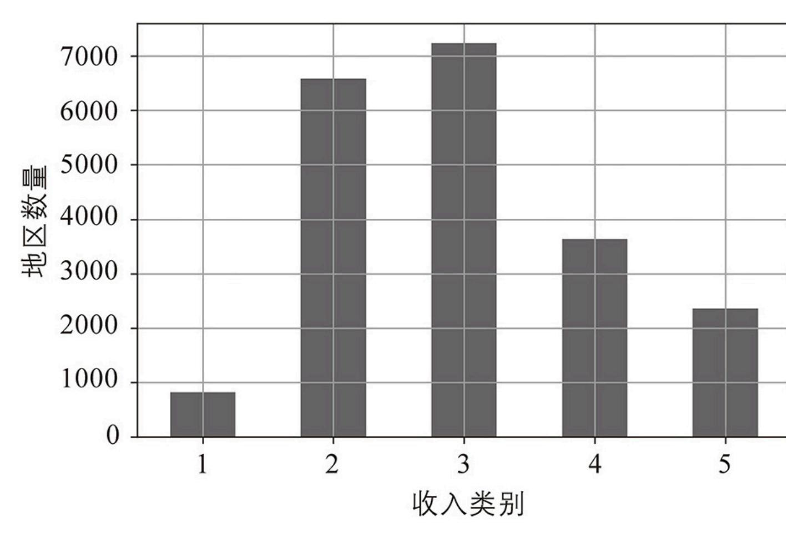

▲图2-9:收⼊类别直⽅图

现在你可以根据收⼊类别进⾏分层采样了。Scikit-Learn在sklearn.model\_selection包中提供了许多拆分 类,它们实现了各种策略,将数据集拆分为训练集和测试集。每个拆分器都有⼀个split()⽅法, 该⽅法返回对相同数据的不同训练/测试拆分的迭代器。

准确地说,split()⽅法产⽣训练和测试指标,⽽不是数据本身。如果你想更好地估计模型的性 能,那么进⾏多次拆分会很有⽤,正如我们将在本章后⾯讨论交叉验证时所看到的。例如,以下代 码⽣成同⼀数据集的10个不同的分层拆分:

#### 现在,你可以只使⽤第⼀个拆分:

或者,由于分层采样相当普遍,因此有⼀种更简洁的⽅法可以使⽤带有stratify参数的train\_test\_split ()函数来获得单个拆分:

让我们看看这是否按预期⼯作。可以从查看测试集中的收⼊类别⽐例开始:

使⽤类似的代码,你可以测量完整数据集中的收⼊类别⽐例。图2-10⽐较了完整数据集、分层采 样⽣成的测试集和纯随机采样⽣成的测试集中的收⼊类别⽐例。如你所⻅,使⽤分层采样⽣成的测 试集的收⼊类别⽐例与完整数据集中的收⼊类别⽐例⼏乎相同,⽽使⽤纯随机采样⽣成的测试集则 存在偏差。

| 收入<br>类别 | 完整<br>数据集% | 分层<br>采样 % | 纯随机<br>采样 % | 分层采样<br>偏差% | 纯随机采料<br>偏差% |
|----------|------------|------------|-------------|-------------|--------------|
| 1        | 3.98       | 4.00       | 4.24        | 0.36        | 6.45         |
| 2        | 31.88      | 31.88      | 30.74       | -0.02       | -3.59        |
| 3        | 35.06      | 35.05      | 34.52       | -0.01       | -1.53        |
| 4        | 17.63      | 17.64      | 18.41       | 0.03        | 4.42         |
| 5        | 11.44      | 11.43      | 12.09       | -0.08       | 5.63         |

图2-10:分层采样与纯随机采样的采样偏差⽐较

你不会再次使⽤income\_cat列,因此你不妨删除它,将数据恢复到其原始状态:

我们在测试集⽣成上花费了⼤量时间是有充分理由的:这是机器学习项⽬中经常被忽视但⾄关重要 的部分。此外,当我们讨论交叉验证时,其中的许多想法都会很有⽤。现在是时候进⼊下⼀阶段 了:探索数据。

## 2.4 探索和可视化数据以获得⻅解

到⽬前为⽌,你只是快速浏览了数据来⼤致了解你正在处理的数据类型。现在的⽬标是更深⼊了 解。

⾸先,确保你已经把测试集放在⼀边,你只是在探索训练集。其次,如果训练集⾮常⼤,你可能希 望对探索集进⾏采样,使探索阶段的操作变得简单快捷。在这种情况下,训练集很⼩,所以你可以 直接在完整数据集上⼯作。由于你要实验完整训练集的各种变换,因此你应该制作⼀份原始副本, 以便之后可以恢复:

#### 2.4.1 可视化地理数据

因为数据集包含地理信息(纬度和经度),所以创建所有地区的散点图来可视化数据是个好主意 (⻅图2-11):

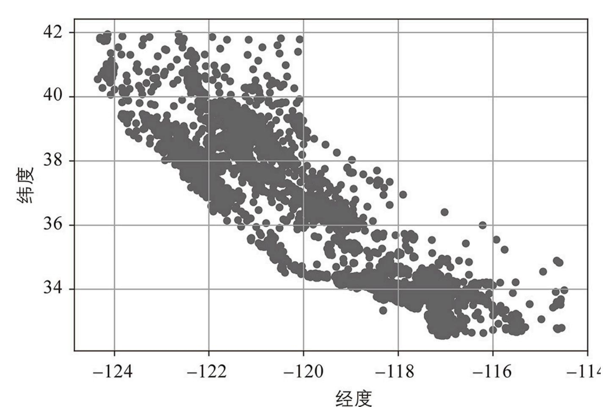

#### ▲图2-11:数据的地理散点图

这看起来很像加州,但除此之外很难看到任何特定的模式。将alpha选项设置为0.2,可以更容易地可 视化数据点密度⾼的地⽅(⻅图2-12):

现在好多了:你可以清楚地看到⾼密度区域,即湾区以及洛杉矶和圣迭⼽周围,以及中央⼭⾕中⼀ ⻓串相当⾼密度的区域(特别是萨克拉⻔托和弗雷斯诺周围)。

我们的⼤脑⾮常擅⻓发现图⽚中的模式,但你可能需要尝试使⽤可视化参数才能使模式脱颖⽽出。

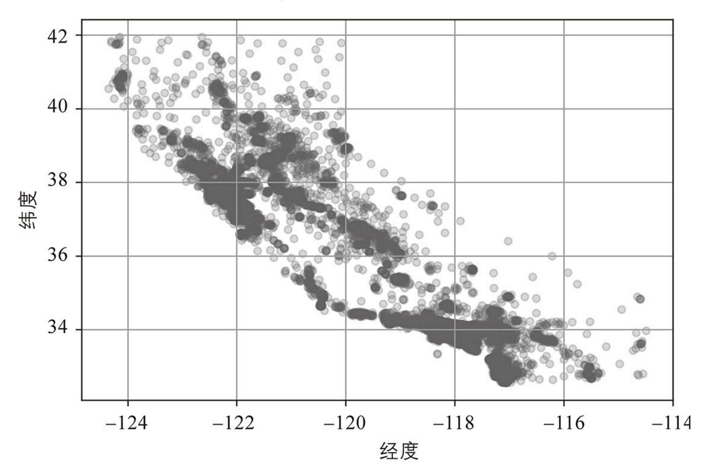

图2-12:突出显⽰⾼密度区域的更好的可视化

<span id="page-19-0"></span>如果你以灰度模式阅读本⽂,请拿起⼀⽀红笔在从湾区到圣地亚哥的⼤部分海岸线上画画(如你所 料)。你也可以在萨克拉⻔托周围添加⼀块⻩⾊。

接下来看看房价(⻅图2-13)。每个圆圈的半径代表该地区的⼈⼝数量(选项s),颜⾊代表价格 (选项c)。在这⾥,你使⽤名为jet的预定义颜⾊图(选项cmap),其范围从蓝⾊(低)到红⾊ (⾼) [:](#page-19-0)

图2-13告诉你,房价与地理位置(例如靠近海洋)和⼈⼝密度密切相关,你可能已经知道了。聚 类算法应该有助于检测主集群和添加新特征来衡量与集群中⼼的接近程度。海洋邻近度也可能是有 ⽤的属性,不过北加州沿海地区的房价不是太⾼,所以这个简单的规则也不是万能的。

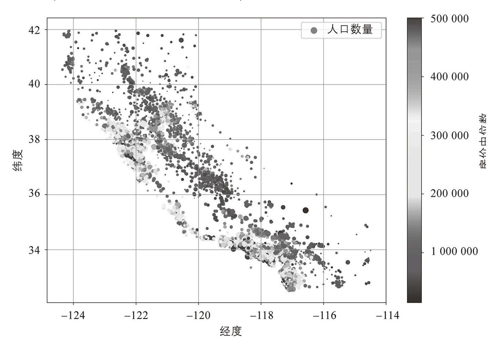

图2-13:加州房价:红⾊为昂贵,蓝⾊为便宜,圆圈越⼤代表地区⼈⼝越多

#### 2.4.2 寻找相关性

由于数据集不是太⼤,你可以使⽤corr()⽅法轻松计算出每对属性之间的标准相关系数(也称为 ⽪尔逊r):

现在你可以查看每个属性与房价中位数的相关性:

相关系数取值范围为-1到1。它越接近1,表示存在越强的正相关。例如,当收⼊中位数上升时,房 价中位数往往会上升。当系数接近-1时,表示存在很强的负相关。你可以看到纬度和房价中位数之 间存在弱的负相关(即当你向北⾛时,价格略有下降的趋势)。最后,接近于0的系数意味着不存 在线性相关。

查看属性之间相关性的另⼀种⽅法是使⽤Pandas的scatter\_matrix()函数,该函数将每个数值属性 与其他每个数值属性进⾏对⽐。由于现在有11个数值属性,你将得到11 <sup>2</sup>=121个图表,这些图表⽆法 放在⼀⻚纸上,因此你要关注⼀些看起来与房价中位数最相关的属性(⻅图2-14):

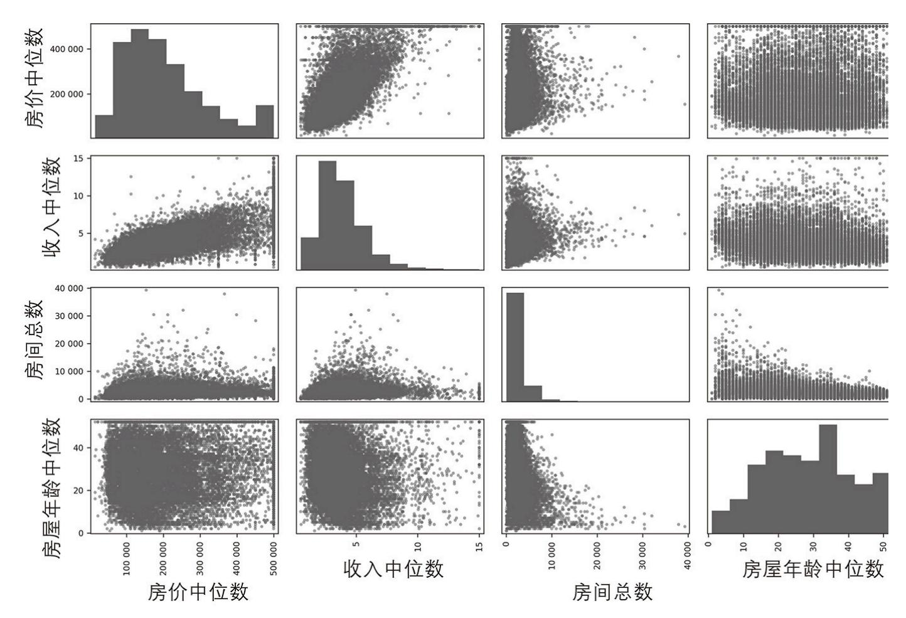

▲图2-14:这个散布矩阵绘制了每个数值属性与其他每个数值属性的对⽐图,加上主对⻆线上每个 数值属性的直⽅图(左上到右下)

如果Pandas把每个变量与它⾃身画⼀个图,则主对⻆线将全都是直线,这样毫⽆意义。因此取⽽ 代之的是,Pandas显示每个属性的直⽅图(有其他选项可⽤,有关更多详细信息请参阅Pandas⽂ 档)。

查看相关散点图,预测房价中位数最有希望的属性似乎是收⼊中位数,因此你可以放⼤散点图(⻅ 图2-15):

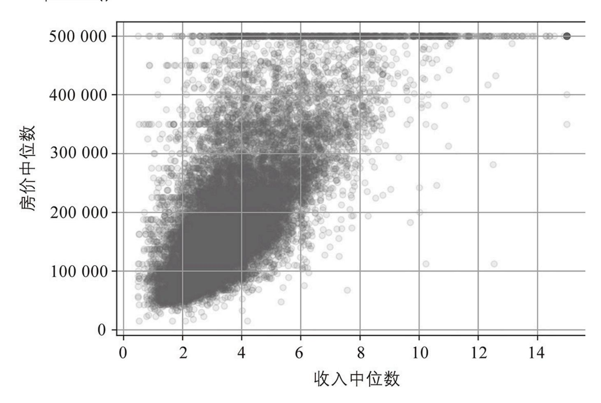

▲图2-15:收⼊中位数与房价中位数

这个图揭示了⼀些事情。⾸先,相关性确实很强,你可以清楚地看到上升趋势,⽽且点不是太分 散。其次,你之前注意到的价格上限清晰可⻅,为500000美元的⽔平线。但该图还揭示了其他不 太明显的直线:450000美元附近有⼀条⽔平线,350000美元附近也有⼀条,280000美元附近似 乎隐约也有⼀条,再往下可能还有⼏条。你可能想尝试删除相应的地区,以防⽌你的算法学习重现 这些数据。


相关系数仅衡量线性相关性("随着x上升,y通常上升/下降")。它可能会完全错过⾮线性关系 (例如,"当x接近0时,y通常会上升")。

图2-16展示了各种数据集及其相关系数。请注意,尽管事实上它们的轴显然不是独⽴的,但底⾏ 的所有图的相关系数都为0:这些是⾮线性关系的样例。此外,第⼆⾏显示相关系数为1或-1的样 例,请注意,这与斜率⽆关。例如,以英⼨为单位的身⾼与以英尺或纳⽶为单位的身⾼的相关系数 为1。

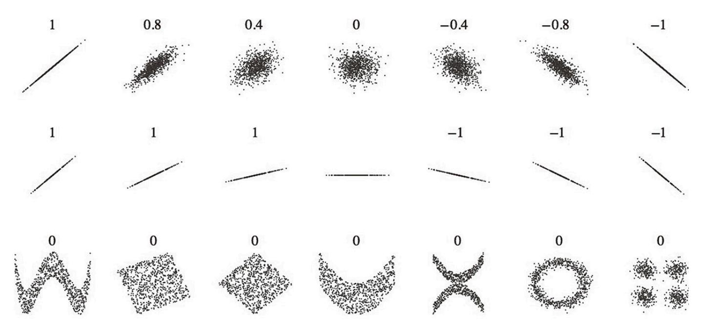

图2-16:各种数据集的标准相关系数(来源:维基百科,公共领域图像)

## 2.4.3 实验不同属性组合

通过前⾯⼏节的介绍,希望你了解了探索数据和获得⻅解的⼏种⽅法。在将数据提供给机器学习算 法之前,你确定了⼀些你可能想要清理的数据,并且你发现了属性之间有趣的相关性,尤其是与⽬ 标属性之间的相关性。你还注意到某些属性呈右偏分布,因此你可能希望对它们进⾏变换(例如, 通过计算它们的对数或平⽅根)。当然,你的⼯作时数会因每个项⽬⽽有很⼤差异,但总体思路是 相似的。

在为机器学习算法准备数据之前,你可能想要做的最后⼀件事是尝试各种属性组合。例如,如果你 不知道⼀个地区有多少户⼈家,则该地区的房间总数就没有多⼤⽤处。你真正想要的是每个家庭的 房间数。同样,卧室总数本身也不是很有⽤:你可能想将其与房间数量进⾏⽐较。每户⼈⼝似乎也 是⼀个值得关注的有趣属性组合。你可以按如下⽅式创建这些新属性:

#### 然后再次查看相关矩阵:

嘿,还不错!与房间或卧室总数相⽐,新的bedrooms\_ratio属性与房价中位数的相关性更⾼。显然, 卧室/房间⽐例较低的房⼦往往更贵。每户房间的数量也⽐⼀个地区的房间总数更具信息量,显然 房⼦越⼤,它们就越贵。

这⼀轮探索不需要很彻底,关键是要从正确的脚步开始并快速获得⻅解,这将帮助你获得第⼀个相 当不错的原型。但这是⼀个迭代过程:⼀旦你启动并运⾏了⼀个原型,你就可以分析它的输出来获 得更多的⻅解并返回到这个探索步骤。

## 2.5 为机器学习算法准备数据

是时候为你的机器学习算法准备数据了。这⾥你应该为这个⽬的编写函数,⽽不是⼿动执⾏此操 作,原因如下:

- ·你可以在任何数据集上轻松地重现这些转换(例如,下次你获得新的数据集时)。
- ·你可以逐步构建⼀个可在未来项⽬中重复使⽤的转换函数库。
- ·你可以在实时系统中使⽤这些函数来转换新数据,再将其提供给你的算法。
- ·你可以轻松尝试各种转换并查看哪种转换组合效果最好。

但⾸先,要恢复到⼲净的训练集(通过再次复制strat\_train\_set)。你还应该将预测变量和标签分开, 因为你不⼀定要对预测变量和⽬标值应⽤相同的转换(请注意drop()创建数据的副本并且不影响 strat\_train\_set):

#### 2.5.1 清洗数据

⼤多数机器学习算法⽆法处理缺失的特征,因此你需要处理这些问题。例如,你之前注意到 total\_bedrooms属性有⼀些缺失值。你可以通过三个选项来解决此问题:

1. 去掉相应的地区。

- 2. 去掉整个属性。
- 3. 将缺失值设置为某个值(零、均值、中位数等)。这称为归责。

你可以使⽤Pandas DataFrame的dropna()、drop()和fillna()⽅法轻松完成这些操作:

你决定选择选项3,因为它破坏性最⼩,但你将使⽤⼀个⽅便的Scikit-Learn类:SimpleImputer,⽽ 不是前⾯的代码。它的好处是将存储每个特征的中位数值:这不仅可以在训练集上估算缺失值,⽽ 且可以在验证集、测试集和任何提供给模型的新数据上估算缺失值。要使⽤它,⾸先你需要创建⼀ 个SimpleImputer实例,指定你要⽤该属性的中位数替换每个属性的缺失值:

由于只能根据数值属性来计算中位数,因此你需要创建仅包含数值属性的数据副本(这将排除⽂本 属性ocean\_proximity):

现在你可以使⽤fit()⽅法将imputer实例拟合到训练数据中:

imputer简单地计算了每个属性的中位数并将结果存储在它的statistics\_实例变量中。只有 total\_bedrooms属性有缺失值,但你不能确定系统上线后新数据中不会有任何缺失值,所以对所有数 值属性应⽤imputer更安全:

现在你可以使⽤这个"训练有素"的imputer来通过⽤学习到的中位数替换缺失值来转换训练集:

缺失值也可以替换为平均值(strategy="mean"),或替换为最频繁的值 (strategy="most\_frequent"),或替换为常数值(strategy="constant",fill\_value=...)。最 后两种策略⽀持⾮数值数据。


sklearn.impute包中还有更强⼤的imputers(两者都仅⽤于数值特征):

- ·KNNImputer将每个缺失值替换为该特征的k近邻的平均值。该距离基于所有可⽤的特征。
- ·IterativeImputer为每个特征训练⼀个回归模型,以根据所有其他可⽤特征预测缺失值。然后,它会根 据更新后的数据再次训练模型,并多次重复该过程,在每次迭代中改进模型和替换值。

#### Scikit-Learn的设计

<span id="page-26-0"></span>有关设计原则的更多详细信息,请参阅Lars Buitinck等⼈的"API Design for Machine Learning Software:Experiences from the Scikit-Learn Project",arXiv preprint arXiv: . (2013)。

Scikit-Learn的API设计得⾮常好。这些是主要设计原则(https://homl.info/11) [:](#page-26-0)

#### ⼀致性

所有对象共享⼀个⼀致且简单的接⼝。

#### 估计器

任何可以根据数据集估计某些参数的对象都称为估计器(例如,SimpleImputer是估计器)。估计本身 由fit()⽅法执⾏,它将⼀个数据集作为参数(或两个数据集⽤于监督学习算法,第⼆个数据集包 含标签)。指导估计过程所需的任何其他参数都被视为超参数(例如SimpleImputer的strategy),并且 必须将其设置为实例变量(通常通过构造函数参数)。

#### 转换器

⼀些估计器(例如SimpleImputer)也可以转换数据集,这些被称为转换器。同样,API很简单:转换 由transform()⽅法执⾏,将要转换的数据集作为参数。它返回转换后的数据集。这种转换通常依 赖于学习到的参数,就像SimpleImputer的情况⼀样。所有的转换器还有⼀个名为fit\_transform()的便 捷⽅法,相当于先调⽤fit()再调⽤transform()(但有时fit\_transform()会经过优化,运⾏速度更 快)。

#### 预测器

<span id="page-26-1"></span>⼀些预测器还提供了测量其预测可信度的⽅法。

最后,⼀些估计器在给定数据集的情况下能够进⾏预测,这些被称为预测器。例如,第1章中的 LinearRegression模型是⼀个预测器,给定⼀个国家的⼈均GDP,它预测⽣活满意度。预测器有⼀个 predict()⽅法,它获取新实例的数据集并返回相应预测的数据集。它还有⼀个score()⽅法,可 以在给定测试集(以及,在监督学习算法中对应的标签)的情况下测量预测的质量 [。](#page-26-1)

#### 检查

所有估计器的超参数都可以通过公开实例变量(例如,imputer.strategy)直接访问,并且所有估计器 的学习参数可以通过带有下划线后缀的公共实例变量访问(例如,imputer.statistics\_)。

#### 防⽌类扩散

数据集表示为NumPy数组或SciPy稀疏矩阵,⽽不是⾃定义类。超参数只是常规的Python字符串或 数字。

#### 构成

尽可能重⽤现有的构建块。例如,正如你看到的,很容易从任意序列的转换器来创建⼀个Pipeline估 计器,然后是最终估计器。

#### 合理的默认值

Scikit-Learn为⼤多数参数提供了合理的默认值,可以轻松快速地创建基本⼯作系统。

<span id="page-27-0"></span>当你阅读这些⾏时,可能会在所有转换器接收到DataFrame作为输⼊时输出Pandas DataFrame:Pandas in,Pandas out。可能会有⼀个全局配置选项:sklearn.set\_config (pandas\_in\_out=True)。

Scikit-Learn转换器输出NumPy数组(或有时是SciPy稀疏矩阵),即使将Pandas DataFrame作 为输⼊ [。](#page-27-0)因此,imputer.transform(housing\_num)的输出是⼀个 NumPy数组:X既没有列名也没 有索引。幸运的是,将X包装在DataFrame中并从housing\_num中恢复列名和索引并不难:

## 2.5.2 处理⽂本和类别属性

到⽬前为⽌,我们只处理了数字属性,但你的数据也可能包含⽂本属性。在这个数据集中,只有⼀ 个:ocean\_proximity属性。让我们看看它在前⼏个实例中的值:

它不是任意⽂本:可能的值数量有限,每个值代表⼀个类别。所以这个属性是⼀个类别属性。⼤多 数机器学习算法更喜欢处理数字,所以让我们将这些类别从⽂本转换为数字。为此,我们可以使⽤ Scikit-Learn的OrdinalEncoder类:

这是housing\_cat\_encoded中前⼏个编码值的样⼦:

你可以使⽤categories\_实例变量来获取类别列表。它是⼀个包含每个分类属性的⼀维类别数组的列表 (在本例中,列表包含⼀个数组,因为只有⼀个分类属性):

这种表示的⼀个问题是ML算法会假设两个距离较近的值⽐两个距离较远的值更相似。这在某些情 况下可能没问题(例如,对于有序类别,如"坏""平均""好"和"优秀"),但ocean\_proximity列显然不 是情况(例如,类别0和4显然⽐类别0和1更相似)。要解决此问题,⼀种常⻅的解决⽅案是为每 个类别创建⼀个⼆进制属性:当类别为"<1H OCEAN"时,这个属性等于1(否则为0),当类别 为"INLAND"时,另⼀个属性等于1 (否则为0),以此类推。这称为独热编码,因为只有⼀个属性会 等于1(热),⽽其他属性将为0(冷)。新属性有时称为虚拟属性。Scikit-Learn提供了⼀个 OneHotEncoder类来将类别值转换为独热向量:

默认情况下,OneHotEncoder的输出是SciPy稀疏矩阵,⽽不是NumPy数组:

<span id="page-28-0"></span>有关详细信息,请参阅SciPy的⽂档。

对于主要包含零的矩阵,稀疏矩阵是⼀种⾮常有效的表示。实际上,它在内部仅存储⾮零值及其位 置。当⼀个类别属性有成百上千个类别时,独热编码会产⽣⼀个⾮常⼤的矩阵,除了每⾏⼀个1之 外其他元素全是0。在这种情况下,稀疏矩阵正是你所需要的:它将节省⼤量内存并加快计算速 度。你可以像普通⼆维数组⼀样使⽤稀疏矩阵 [,](#page-28-0)但如果你想将其转换为(密集)NumPy数组, 只需调⽤toarray()⽅法:

或者,你可以在创建OneHotEncoder时设置sparse=False,在这种情况下,transform()⽅法将直接返回 常规的(密集)NumPy数组。

与OrdinalEncoder⼀样,你可以使⽤编码器的categories\_实例变量获取类别列表:

Pandas有⼀个名为get\_dummies()的函数,它将每个分类特征转换为独热表示,每个类别有⼀个⼆ 元特征:

它看起来既漂亮⼜简单,那么为什么不使⽤它来代替OneHotEncoder呢?好吧,OneHotEncoder的优势在 于它会记住经过了哪些类别的训练。这⾮常重要,因为⼀旦你的模型投⼊⽣产,它应该被提供与训 练期间完全相同的特征:不多也不少。看看经过训练的cat\_encoder在我们转换相同的df\_test时会输出 什么[使⽤transform(),⽽不是fit\_transform()]:

看到不同了吗?get\_dummies()只看到两个类别,因此它输出两列,⽽OneHotEncoder以正确的顺序 为每个学习到的类别输出⼀列。此外,如果你向get\_dummies()提供⼀个包含未知类别(例如,"< 2H OCEAN")的DataFrame,它会为其⽣成⼀列:

但OneHotEncoder更聪明:它会检测未知类别并引发异常。如果你愿意,可以将handle\_unknown超参数 设置为"忽略",在这种情况下,它将只⽤零表示未知类别:


如果分类属性有⼤量可能的类别(例如,国家代码、职业、物种),则独热编码将导致⼤量输⼊特 征。这可能会减慢训练速度并降低性能。如果发⽣这种情况,你可能希望⽤与类别相关的有⽤数值 特征来替换分类输⼊。例如,你可以将ocean\_proximity特征替换为到海洋的距离(类似地,国家代码 可以替换为国家的⼈⼝数量和⼈均GDP)。你也可以使⽤GitHub(https://github.com/scikitlearn-contrib/category\_encoders)上的category\_encoders包提供的编码器。或者,在处理神经⽹络 时,你可以⽤称为嵌⼊的可学习的低维向量替换每个类别。这是表示的⼀个示例(更多细节参⻅第 13章和第17章)。

当你使⽤DataFrame拟合任何Scikit-Learn估计器时,估计器会将列名称存储在feature\_names\_in\_属 性中。然后,Scikit-Learn确保之后馈送到该估计器的任何DataFrame [例如,到transform()或 predict()]具有相同的列名。Transformer还提供了⼀个get\_feature\_names\_out()⽅法,你可以使⽤ 该⽅法围绕Transformer的输出构建DataFrame:

#### 2.5.3 特征缩放和转换

你需要应⽤于数据的最重要的转换之⼀是特征缩放。除了少数例外,机器学习算法在输⼊数值属性 具有⾮常不同的尺度时表现不佳。房屋数据就是这种情况:房间总数⼤约在6~39320之间,⽽收 ⼊中位数仅在0~15之间。如果不进⾏任何缩放,⼤多数模型将偏向于忽略收⼊中位数并更多地关 注于房间的数量。

有两种常⽤的⽅法可以使所有属性具有相同的尺度:最⼩-最⼤缩放和标准化。


与所有估计器⼀样,重要的是仅把缩放器拟合到训练数据:永远不要对训练集以外的任何其他对象 使⽤fit()或fit\_transform()。⼀旦你有了⼀个训练好的缩放器,你就可以⽤它来transform()任何 其他集合,包括验证集、测试集和新数据。请注意,虽然训练集值将始终缩放到指定范围,如果新 数据包含异常值,这些值可能最终会缩放到范围之外。如果你想避免这种情况,只需将clip超参数 设置为True。

最⼩-最⼤缩放(很多⼈称之为归⼀化)是最简单的:对于每个属性,值被移动和重新缩放,这样 它们最终值在0~1之间。这是通过减去最⼩值并除以最⼩值和最⼤值之间的差值来执⾏的。 Scikit-Learn为此提供了⼀个名为MinMaxScaler的转换器。它有⼀个feature\_range超参数,如果出于某 种原因你不想要0~1,则允许你更改范围(例如,神经⽹络在零均值输⼊下效果最好,因此-1~1 的范围更可取)。它很容易使⽤:

标准化是不同的:⾸先它减去平均值(因此标准化值的均值为零),然后将结果除以标准差(因此 标准化值的标准差等于1)。与最⼩-最⼤缩放不同,标准化不会将值限制在特定范围内。但是,标 准化受异常值的影响要⼩得多。例如,假设⼀个地区的收⼊中位数等于100(错误数据),⽽不是 通常的0~15。最⼩-最⼤缩放到0~1范围会将此异常值映射到1,并将所有其他值压缩到0~0.15, ⽽标准化不会受到太⼤影响。Scikit-Learn提供了⼀个名为StandardScaler的转换器⽤于标准化:


如果你想缩放稀疏矩阵⽽不先将其转换为密集矩阵,则可以使⽤StandardScaler,并将其with\_mean超参 数设置为False:它只会将数据除以标准差,⽽不减去均值(因为这会破坏稀疏性)。

当⼀个特征的分布有⼀个重尾(heavy tail)时(即当远离平均值的值不是指数级稀有时),最⼩- 最⼤缩放和标准化都会将⼤多数值压缩到⼀个⼩范围内。机器学习模型通常不喜欢这样,正如你将 在第4章中看到的那样。因此,在缩放特征之前,你应该⾸先对其进⾏变换来缩⼩重尾,并尽可能 使分布⼤致对称。例如,对于右侧有重尾的正特征,⼀种常⻅的⽅法是⽤它的平⽅根来替换特征 (或将特征提升到0~1之间的幂)。如果该特征有⼀个很⻓很重的尾巴,例如幂律(power law) 分布,那么⽤对数替换该特征可能会有帮助。例如,population特征⼤致遵循幂律:拥有10000名居 ⺠的地区出现频率仅⽐拥有1000名居⺠的地区低10倍,⽽不是呈指数级降低。图2-17展示了当你 计算它的对数时这个特征看起来有多好:它⾮常接近⾼斯分布(即钟形)。

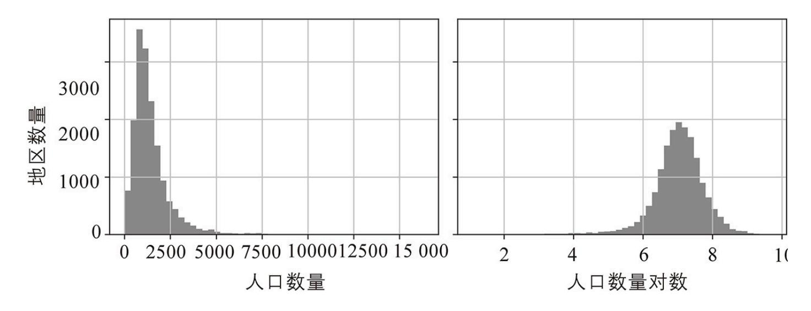

图2-17:变换特征使其更接近⾼斯分布

处理重尾特征的另⼀种⽅法是对特征进⾏分桶(bucketizing)。这意味着将其分布分成⼤致相等 ⼤⼩的桶,并⽤它所属的桶的索引替换每个特征值,就像我们创建income\_cat特征时所做的⼀样(尽 管我们只将其⽤于分层采样)。例如,你可以将每个值替换为其百分位数。使⽤⼤⼩相等的桶进⾏ 分桶会产⽣⼏乎均匀分布的特征,因此⽆须进⼀步缩放,或者你可以仅除以桶的数量来强制值在0 ~1范围内。

当⼀个特征具有多峰分布(即具有两个或更多清晰的峰,称为模式)时,例如housing\_median\_age特 征,将其分桶也很有帮助,但这次将桶的ID视为类别,⽽不是数值。这意味着必须对桶索引进⾏编 码,例如使⽤OneHotEncoder(所以你通常不想使⽤太多的桶)。这种⽅法将使回归模型更容易学习 针对该特征值的不同范围的不同规则。例如,⼤约35年前建造的房屋可能具有⼀种过时的奇特⻛ 格,因此它们的价格⽐单凭其年龄所表明的要便宜。

另⼀种转换多峰分布的⽅法是为每个模式(⾄少是主要模式)添加⼀个特征,表示房屋年龄中位数 与该特定模式之间的相似性。相似性度量通常使⽤径向基函数(Radial Basis Function,RBF)计 算——任何⼀个仅取决于输⼊值和固定点之间距离的函数。最常⽤的RBF是⾼斯RBF,其输出值随 着输⼊值远离固定点⽽呈指数衰减。例如,房屋年龄x和35之间的⾼斯RBF相似性由⽅程exp(-<sup>γ</sup> (x-35)2)给出。超参数γ(gamma)决定了当x远离35时相似性度量衰减的速度。使⽤Scikit-Learn的rbf\_kernel()函数,可以创建⼀个新的⾼斯RBF特征来测量房屋年龄中位数与35之间的相 似性:

图2-18展示了这个作为房屋年龄中位数(实线)的函数的新特征。它还展示了如果你使⽤较⼩的 gamma值,该函数会是什么样⼦。如图2-18所示,新的年龄相似性特征在35处达到峰值,正好在房 屋年龄中位数分布的峰值附近:如果这个特定年龄组与较低的价格密切相关,那么这个新特征很有 可能会有所帮助。

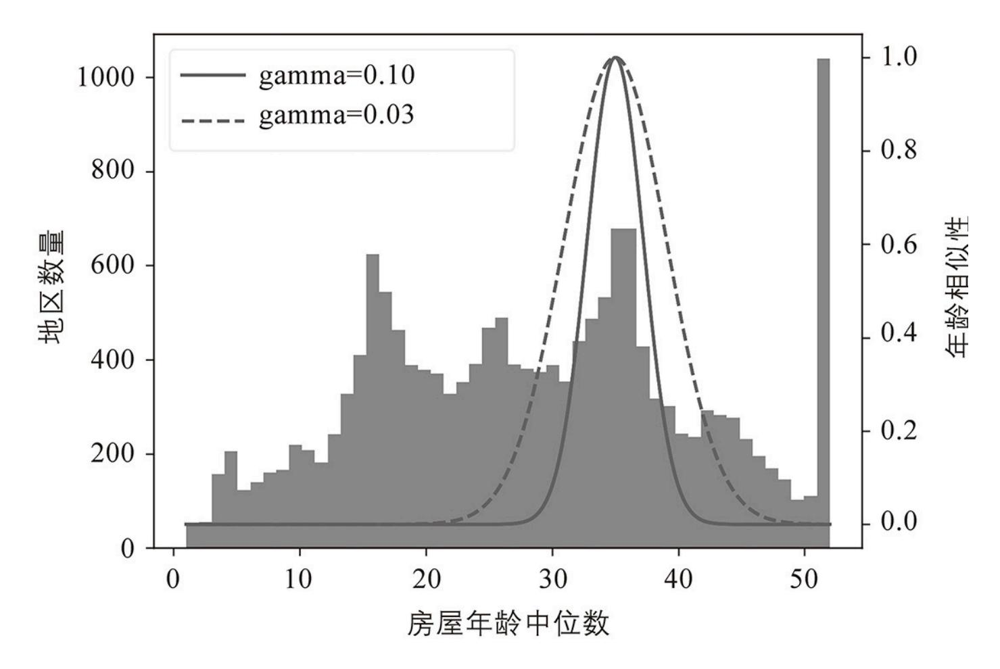

图2-18:⾼斯RBF特征测量房屋年龄中位数与35之间的相似性

到⽬前为⽌,我们只查看了输⼊特征,但⽬标值可能还需要转换。例如,如果⽬标分布有⼀条重 尾,你可以选择⽤其对数替换⽬标。但如果这样做,现在回归模型将预测房价中位数的对数,⽽不 是房价中位数本身。如果你想要已预测的房屋中位数,则需要计算模型预测的指数。

幸运的是,⼤多数Scikit-Learn的转换器都有⼀个inverse\_transform()⽅法,这使得计算它们的逆转 换变得容易。例如,下⾯的代码展示了如何使⽤StandardScaler来缩放标签(就像我们对输⼊所做的 那样),然后在⽣成的缩放标签上训练⼀个简单的线性回归模型,并使⽤它对⼀些新数据进⾏预 测,我们使⽤经过训练的缩放器的inverse\_transform()⽅法转换回原始尺度。请注意,我们将标签 从Pandas Series转换为DataFrame,因为StandardScaler需要2D输⼊。此外,在此示例中,为简单 起⻅,我们仅在单个原始输⼊特征(收⼊中位数)上训练模型:

这很好⽤,但更简单的选择是使⽤TransformedTargetRegressor。我们只需要构造它,给它回归模型和 标签转换器,然后使⽤原始的未缩放标签,将它拟合到训练集上。它将⾃动使⽤转换器来缩放标签 并在缩放后的标签上训练回归模型,就像我们之前所做的那样。然后,当我们想要进⾏预测时,它 会调⽤回归模型的predict()⽅法并使⽤缩放器的inverse\_transform()⽅法来产⽣预测:

#### 2.5.4 定制转换器

尽管Scikit-Learn提供了许多有⽤的转换器,但你需要编写⾃⼰的转换器来执⾏⾃定义转换、清洗 操作或组合⼀些特定的属性等任务。

对于不需要任何训练的转换,你只需编写⼀个函数,将NumPy数组作为输⼊并输出转换后的数 组。例如,如上⼀节所述,通过将重尾分布的特征替换为它们的对数(假设特征为正且尾部在右 侧)来转换具有重尾分布的特征通常是个好主意。让我们创建⼀个对数转换器并将其应⽤于 population特征:

inverse\_func参数是可选的。它允许你指定⼀个逆变换函数,例如,如果你计划在 TransformedTargetRegressor中使⽤你的转换器。

你的转换函数可以将超参数作为附加参数。例如,下⾯是如何创建⼀个转换器来计算与之前相同的 ⾼斯RBF相似性度量:

请注意,RBF内核没有反函数,因为在距离固定点的给定距离处总是有两个值(距离0除外)。另 请注意,rbf\_kernel()不会单独处理这些特征。如果你向它传递⼀个具有两个特征的数组,它会测 量2D距离(欧⼏⾥得)来测量相似性。例如,以下是如何添加⼀个特征来测量每个地区与旧⾦⼭ 之间的地理相似性:

⾃定义转换器也可⽤于组合特征。例如,这⾥有⼀个计算输⼊特征0和1之间⽐率的

FunctionTransformer:

FunctionTransformer⾮常⽅便,但是如果你希望你的转换器是可训练的,可以在fit()⽅法中 学习⼀些参数并稍后在transform()⽅法中使⽤它们,你该怎么办?为此,你需要编写⼀个⾃定义 类。Scikit-Learn依赖鸭⼦类型,因此此类不必继承⾃任何特定的基类。它只需要三个⽅法:fit ()(必须返回self)、transform()和fit\_transform()。

你只需将TransformerMixin添加为基类即可以得到fit\_transform():默认实现将只调⽤fit(),然后调 ⽤transform()。如果将BaseEstimator添加为基类(避免在构造函数中使⽤\*args和\*\*kwargs),你还将 获得两个额外的⽅法:get\_params()和set\_params()。这些对于⾃动超参数调整很有⽤。

例如,这⾥有⼀个与StandardScaler⾮常相似的⾃定义转换器:

#### 这⾥有⼏点需要注意:

- ·sklearn.utils.validation包包含⼏个我们可以⽤来验证输⼊的函数。为简单起⻅,我们将在本书的其余部 分跳过此类测试,但⽣产环境代码应该有它们。
- ·Scikit-Learn流⽔线要求fit()⽅法有两个参数X和y,这就是为什么我们需要y=None参数,即使我 们不使⽤y。
- ·所有Scikit-Learn估计器都在fit()⽅法中设置n\_features\_in\_,它们确保传递给transform()或predict ()的数据具有这个数量的特征。

·fit()⽅法必须返回self。

·此实现并没有100%完成:所有估计器在传递DataFrame时都应在fit()⽅法中设置 feature\_names\_in\_。此外,所有的转换器都应该提供⼀个get\_feature\_names\_out()⽅法,以及⼀个 inverse\_transform()⽅法,当它们的转换可以被逆转时。有关详细信息,请参阅本章末尾的最后⼀ 个练习。

⾃定义转换器可以(并且经常)在其实现中使⽤其他估计器。例如,以下代码演示了使⽤KMeans的 ⾃定义转换器在fit()⽅法中识别出训练数据中的主要集群,然后在transform()⽅法中使⽤ rbf\_kernel()来测量每个样本与每个集群中⼼的相似程度:

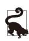

你可以通过将实例传递给sklearn.utils.estimator\_checks包中的check\_estimator()来检查你的⾃定义估算器 是否遵循Scikit-Learn的API。有关完整的API,请查看https://scikitlearn.org/stable/developers。

正如你将在第9章中看到的,k均值是⼀种聚类算法,⽤于在数据中定位集群。它的搜索数量是由 n\_clusters超参数控制的。训练后,集群中⼼可通过cluster\_centers\_属性获得。KMeans的fit()⽅法⽀持 可选参数sample\_weight,它允许⽤户指定样本的相对权重。k均值是⼀种随机算法,意味着它依赖于 随机性来定位集群,所以如果你想要可重现的结果,你必须设置random\_state参数。如你所⻅,尽管 任务很复杂,但代码相当简单。现在让我们使⽤这个⾃定义转换器:

此代码创建⼀个ClusterSimilarity转换器,将集群数设置为10。然后⽤训练集中每个地区的经纬度调⽤ fit\_transform(),⽤每个地区的房价中位数加权。Transformer使⽤k均值来定位集群,然后测量每

个地区与所有10个集群中⼼之间的⾼斯RBF相似性。结果是⼀个矩阵,每个地区⼀⾏,每个集群⼀ 列。让我们看⼀下前三⾏,四舍五⼊到⼩数点后两位:

图2-19展示了k均值找到的10个集群中⼼。这些地区根据其与其最近的集群中⼼的地理相似性进⾏ 着⾊。如你所⻅,⼤多数集群位于⼈⼝稠密和昂贵的地区。

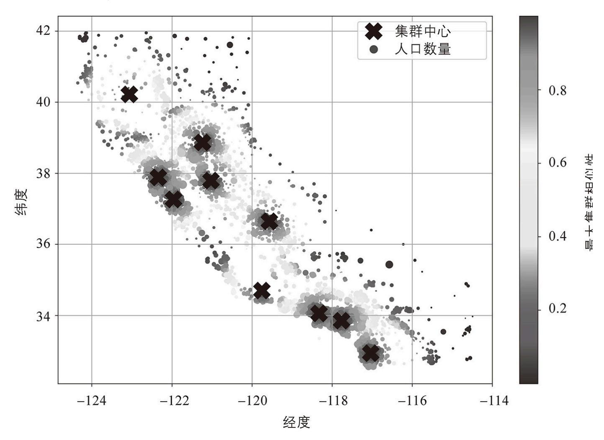

图2-19:⾼斯RBF与最近的集群中⼼的相似性

#### 2.5.5 转换流⽔线

如你所⻅,我们需要以正确的顺序执⾏许多数据转换步骤。幸运的是,Scikit-Learn提供了Pipeline 类来帮助处理此类转换序列。以下是⼀个⽤于数值属性的⼩流⽔线,它⾸先估算然后缩放输⼊特 征:

Pipeline构造函数采⽤定义⼀系列步骤的名称/估计器对(⼆元组)列表。名称可以是你喜欢的任 何名称,只要它们是唯⼀的并且不包含双下划线(\_\_)。稍后,当我们讨论超参数调整时,它们会 很有⽤。估计器必须都是转换器[即它们必须有⼀个fit\_transform()⽅法],除了最后⼀个,它可以 是任何东⻄:转换器、预测器或任何其他类型的估计器。


在Jupyter notebook中,如果你导⼊sklearn并运⾏sklearn .set\_config(display="diagram"),所有 Scikit-Learn估计器都将呈现为交互式图表。这对于可视化流⽔线特别有⽤。要可视化 num\_pipeline,运⾏⼀个以num\_pipeline作为最后⼀⾏的单元格。单击估计器会显示更多细节。

如果不想给转换器命名,则可以使⽤make\_pipeline()函数来代替。它以转换器作为位置参数,并使 ⽤转换器类的名称创建流⽔线,⼩写且不带下划线(例如"simpleimputer"):

如果多个转换器具有相同的名称,则在它们的名称后附加⼀个索引(例如,"foo-1""foo-2"等)。

当你调⽤流⽔线的fit()⽅法时,它会在所有转换器上依次调⽤fit\_transform(),将每次调⽤的输 出作为参数传递给下⼀次调⽤,直到它到达最终的估计器,它只调⽤fit()⽅法。

流⽔线公开了与最终估计器相同的⽅法。在这个示例中,最后⼀个估计器是⼀个StandardScaler,它 是⼀个转换器,所以流⽔线也像⼀个转换器。如果你调⽤流⽔线的transform()⽅法,它将顺序地 将所有转换应⽤于数据。如果最后⼀个估计器是预测器⽽不是转换器,那么流⽔线有⼀个predict ()⽅法⽽不是transform()⽅法。调⽤它会按顺序将所有转换应⽤于数据并将结果传递给预测器 的predict()⽅法。

让我们调⽤流⽔线的fit\_transform()⽅法并查看输出的前两⾏,四舍五⼊到⼩数点后两位:

正如你之前看到的,如果你想恢复⼀个好的DataFrame,则你可以使⽤流⽔线的 get\_feature\_names\_out()⽅法:

流⽔线还⽀持索引;例如,pipeline[1]返回流⽔线中的第⼆个估计器,⽽pipeline[:-]返回⼀个Pipeline 对象,其中包含除最后⼀个估计器之外的所有估计器。你还可以通过steps属性(名称/估计器对列

表)或通过named\_steps字典属性(将名称映射到估计器)访问估计器。例如, num\_pipeline["simpleimputer"]返回名为"simpleimputer"的估计器。

到⽬前为⽌,我们已经分别处理了类别列和数值列。拥有⼀个能够处理所有列的转换器,对每⼀列 应⽤适当的转换会更⽅便。为此,你可以使⽤ColumnTransformer。例如,以下的ColumnTransformer会将 num\_pipeline(我们刚刚定义的)应⽤于数值属性,将cat\_pipeline应⽤于分类属性:

⾸先我们导⼊ColumnTransformer类,然后我们定义数字和类别列名称的列表,并为分类属性构建⼀个 简单的流⽔线。最后,我们构造⼀个ColumnTransformer。它的构造函数需要⼀个三元组的列表,每个 包含⼀个名称(必须是唯⼀的并且不包含双下划线)、⼀个转换器,以及⼀个转换器应该应⽤到的 列的名称(或索引)列表。


如果你希望删除列,则可以指定字符串"drop"⽽不是使⽤转换器,或者如果你希望列保持不变,则 可以指定"passthrough"。默认情况下,剩余的列(即未列出的列)将被删除,但如果你希望以不同⽅ 式处理这些列,则可以将remainder超参数设置为任何转换器(或"passthrough")。

由于列出所有列名不是很⽅便,Scikit-Learn提供了⼀个make\_column\_selector()函数,它返回⼀个 选择器函数,你可以使⽤它来⾃动选择给定类型的所有特征,例如数值或类别。你可以将此选择器 函数传递给ColumnTransformer,⽽不是列名或索引。此外,如果你不关⼼转换器的命名,你可以使⽤ make\_column\_transformer(),它会为你选择名称,就像make\_pipeline()所做的那样。例如,以下代 码创建与之前相同的ColumnTransformer,只是转换器被⾃动命名为"pipeline-1"和"pipeline-2",⽽不 是"num"和"cat":

现在我们已准备好将此ColumnTransformer应⽤于房屋数据:

很好!我们有⼀个预处理流⽔线,它获取整个训练数据集并将每个转换器应⽤于适当的列,然后⽔ 平连接转换后的列(转换器绝不能更改⾏数)。这再⼀次返回⼀个NumPy数组,但你可以使⽤ preprocessing.get\_feature\_names\_out()来获取列名,并将数据包装在⼀个漂亮的DataFrame中,就像 我们之前所做的那样。


OneHotEncoder返回⼀个稀疏矩阵,⽽num\_pipeline返回⼀个密集矩阵。当稀疏矩阵和密集矩阵混 合存在时,ColumnTransformer会估计最终矩阵的密度(即⾮零单元的⽐率),如果密度低于给定阈值 (默认情况下,sparse\_threshold=0.3)。在此示例中,它返回⼀个密集矩阵。

你的项⽬进展很顺利,你⼏乎可以训练⼀些模型了!你现在想要创建⼀个单⼀的流⽔线来执⾏到⽬ 前为⽌实验过的所有转换。让我们回顾⼀下流⽔线将做什么以及为什么做:

- ·数字特征中的缺失值将通过⽤中位数替换它们来估算,因为⼤多数ML算法不期望缺失值。在分类 特征中,缺失值将被最常⻅的类别替换。
- ·类别特征将被独热编码,因为⼤多数ML算法只接受数字输⼊。
- ·计算并添加⼀些⽐率特征:bedrooms\_ratio、rooms\_per\_house和people\_per\_house。希望这些能更好地与 房价中位数相关联,从⽽帮助ML模型。
- ·还添加了⼀些集群相似性特征。这些可能⽐纬度和经度对模型更有⽤。
- ·⻓尾特征被它们的对数取代,因为⼤多数模型更喜欢具有⼤致均匀分布或⾼斯分布的特征。
- ·所有数值特征都将被标准化,因为⼤多数ML算法更喜欢所有特征具有⼤致相同的尺度。

构建流⽔线来执⾏所有这些操作的代码现在看起来应该很熟悉:

```
如果你运⾏此ColumnTransformer,它会执⾏所有转换并输出具有24个特征的NumPy数组:
```

## 2.6 选择和训练模型

最后!你构建了问题、获取了数据并对其进⾏了探索、对训练集和测试集进⾏了采样,还编写了预 处理流⽔线来⾃动清洗数据并为机器学习算法准备了数据。现在是时候选择和训练机器学习模型 了。

#### 2.6.1 在训练集上训练和评估

好消息是,多亏了之前的所有这些步骤,现在⼀切都变得很简单了!你决定开始训练⼀个⾮常基本 的线性回归模型:

完毕!你现在有了⼀个有效的线性回归模型。你在训练集上进⾏尝试,查看前五个预测值并将它们 与标签进⾏⽐较:

好吧,它能正常⼯作,但并⾮总是如此。第⼀个预测相差甚远(超过200000美元!),⽽其他预 测则更好:后两个相差约25%,最后两个相差不到10%。请记住,你选择使⽤了RMSE作为性能度 量,所以你想使⽤Scikit-Learn的mean\_squared\_error()函数测量此回归模型在整个训练集上的 RMSE,将squared参数设置为False:

这总⽐没有好,但显然不是⼀个很好的分数:⼤多数地区的median\_housing\_values在120000~ 265000美元之间,因此68628美元的典型预测误差确实不是很令⼈满意。这是模型⽋拟合训练数 据的样例。发⽣这种情况时,可能意味着这些特征没有提供⾜够的信息来做出良好的预测,或者模 型不够强⼤。正如我们在第1章中看到的,解决⽋拟合的主要⽅法是选择更强⼤的模型,为训练算 法提供更好的特征,或者减少对模型的约束。该模型未正则化,这排除了最后⼀个选项。你可以尝 试添加更多特征,但⾸先你想尝试⼀个更复杂的模型,看看它是如何⼯作的。

你决定尝试DecisionTreeRegressor,因为这是⼀个相当强⼤的模型,能够在数据中发现复杂的⾮线性关 系(决策树在第6章中有更详细的介绍):

现在模型已经训练完毕,你可以在训练集上对其进⾏评估:

等等,什么!⼀点错误都没有?这个模型真的可以完美⽆缺吗?当然,更有可能的是模型对数据严 重过拟合了。你怎么能确定?正如你之前看到的,在准备好启动你有信⼼的模型之前,不要接触测 试集,因此你需要使⽤⼀部分训练集进⾏训练,另⼀部分⽤于模型验证。

#### 2.6.2 使⽤交叉验证进⾏更好的评估

评估决策树模型的⼀种⽅法是使⽤train\_test\_split()函数将训练集拆分为较⼩的训练集和验证集,然 后针对较⼩的训练集训练你的模型并针对验证集对其进⾏评估。这需要⼀些努⼒,但不会太困难, ⽽且效果会很好。

⼀个很好的替代⽅法是使⽤Scikit-Learn的k折交叉验证功能。以下代码将训练集随机拆分为10个 不重叠的⼦集,称为折叠,然后对决策树模型进⾏10次训练和评估,每次选择不同的折叠进⾏评 估,并使⽤其他9次折叠进⾏训练。结果是⼀个包含10个评估分数的数组:


Scikit-Learn的交叉验证功能期望效⽤函数(越⼤越好)⽽不是代价函数(越低越好),因此评分 函数实际上与RMSE相反。这是⼀个负值,因此你需要切换输出的符号来获得RMSE分数。

#### 让我们看看结果:

现在决策树看起来不像之前那么好了。事实上,它的表现似乎与线性回归模型⼏乎⼀样差!请注 意,交叉验证不仅可以让你获得模型性能的估计值,还可以测量该估计值的精确程度(即标准 差)。决策树的RMSE约为66868,标准差约为2061。如果你只使⽤⼀个验证集,你就不会获得此 信息。但是交叉验证是以多次训练模型为代价的,所以它并不总是可⾏的。

如果你为线性回归模型计算相同的指标,你会发现平均RMSE为69858,标准差为4182。所以决策 树模型的表现似乎⽐线性模型稍微好⼀点,但由于严重的过拟合,两种模型差异很⼩。我们知道存 在过拟合问题,因为训练误差很低(实际上为零)⽽验证误差很⾼。

现在让我们尝试最后⼀个模型:RandomForestRegressor。正如你将在第7章中看到的那样,随机森林的 ⼯作原理是在特征的随机⼦集上训练许多决策树,然后对它们的预测进⾏平均。由许多其他模型组 成的此类模型称为集成:它们能够提⾼基础模型(在本例中为决策树)的性能。代码与之前的代码 ⼤致相同:

#### 让我们看看分数:

哇,这好多了:随机森林看起来⾮常适合这项任务!但是,如果你训练RandomForest并在训练集上测 量RMSE,你会发现RMSE⼤约为17474:这要低得多,这意味着仍然存在相当多的过拟合。可能 的解决⽅案是简化模型、对其进⾏约束(即对其进⾏正则化),或者获取更多的训练数据。然⽽, 在你更深⼊地研究随机森林之前,你应该尝试来⾃不同类别机器学习算法的许多其他模型(例如, ⼏个具有不同内核的⽀持向量机,可能还有⼀个神经⽹络),⽽不要花太多时间调整超参数。⽬标 是选择⼀些(2~5个)有前途的模型。

## 2.7 微调模型

假设你现在有⼀份有前途的模型的候选名单。你现在需要微调它们。让我们看⼀下可以做到这⼀点 的⼏种⽅法。

#### 2.7.1 ⽹格搜索

⼀种选择是⼿动调整超参数,直到找到超参数值的最佳组合。这将是⼀项⾮常乏味的⼯作,你可能 没有时间来探索许多组合。

相反,你可以使⽤Scikit-Learn的GridSearchCV类来为你做搜索。你需要做的就是告诉它你希望实验 哪些超参数以及要尝试哪些值,它会使⽤交叉验证来评估所有可能的超参数值的组合。例如,以下 代码搜索RandomForestRegressor的超参数值的最佳组合:

请注意,你可以引⽤流⽔线中的任何估计器的任何超参数,即使该估计器嵌套在多个流⽔线和列转 换器的深处。例如,当Scikit-Learn看到"preprocessing\_\_geo\_\_n\_clusters"时,它会在双下划线处拆分此 字符串,然后在流⽔线中查找名为"preprocessing"的估计器并找到预处理ColumnTransformer。接下来, 它在此ColumnTransformer中查找名为"geo"的转换器,并找到我们在纬度和经度属性上使⽤的 ClusterSimilarity转换器。然后它找到这个转换器的n\_clusters超参数。同样,random\_forest\_\_max\_features指 的是max\_features名为"random\_forest"的估计器的超参数,当然是RandomForest模型(max\_features超参 数将在第7章解释)。


Scikit-Learn流⽔线中包装预处理步骤允许你调整预处理超参数以及模型超参数。这是⼀件好事, 因为它们经常交互。例如,增加n\_clusters可能也需要增加max\_features。如果拟合流⽔线转换器的计 算成本很⾼,你可以将流⽔线的memory超参数设置为缓存⽬录的路径:当你⾸次拟合流⽔线时, Scikit-Learn会将拟合的转换器保存到该⽬录中。如果你随后使⽤相同的超参数再次拟合流⽔线, Scikit-Learn将只加载缓存的转换器。

这个param\_grid中有两个字典,所以GridSearchCV将⾸先评估第⼀个字典中指定的n\_clusters和max\_features 超参数值的所有3×3=9种组合,然后它将尝试第⼆个字典中所有2×3=6种超参数值的组合。所以总 共⽹格搜索将探索9+6=15种超参数值的组合,并且它将对每个组合训练流⽔线3次,因为我们使⽤ 的是3折交叉验证。这意味着总共会有15×3=45轮训练!这可能需要⼀段时间,但完成后你可以获 得最佳的参数组合,如下所示:

在本例中,将n\_clusters设置为15并将max\_features设置为8能得到最佳模型。


由于15是为n\_clusters评估的最⼤值,你可能应该尝试使⽤更⾼的值再次搜索;分数可能会继续提 ⾼。

你可以使⽤grid\_search.best\_estimator\_来访问最佳估计器。如果GridSearchCV使⽤refit=True(默认设置)做 初始化,那么⼀旦它使⽤交叉验证找到了最佳估计器,就会在整个训练集上重新训练它。这通常是 个好主意,因为提供更多的数据可能会提⾼其性能。

评估分数可使⽤grid\_search.cv\_results\_来获得。这是⼀个字典,但是如果你将它包装在⼀个 DataFrame中,你会得到⼀个很好的列表,其中包含每个超参数组合和每个交叉验证拆分的所有测 试分数,以及所有拆分的平均测试分数:

最佳模型的平均测试RMSE分数为44042,这⽐你之前使⽤的默认超参数值(47019)的分数要 好。恭喜,你已成功地微调了最佳模型!

#### 2.7.2 随机搜索

当你探索相对较少的组合时,⽹格搜索⽅法很好,就像在前⾯的示例中⼀样,但RandomizedSearchCV 通常更可取,尤其是当超参数搜索空间很⼤时。这个类的使⽤⽅式与GridSearchCV类⼤致相同,但它 不是尝试所有可能的组合,⽽是评估固定数量的组合,在每次迭代中为每个超参数选择⼀个随机 值。这听起来可能令⼈惊讶,但这种⽅法有⼏个好处:

- ·如果你的⼀些超参数是连续的(或离散的,但有许多可能的值),并且你让随机搜索运⾏1000次 迭代,那么它会为每个超参数探索1000个不同的值,⽽⽹格搜索只会探索你列出的很少⼏个值。
- ·假设⼀个超参数实际上并没有太⼤的区别,但你还不知道。如果它有10个可能的值并将其添加到 ⽹格搜索中,则训练时间将延⻓10倍。但是,如果将其添加到随机搜索中,则不会有任何区别。
- ·如果有6个超参数需要探索,每个都有10个可能的值,那么⽹格搜索除了训练模型⼀百万次之外别 ⽆选择,⽽随机搜索总是可以运⾏你选择的任意次数的迭代。

对于每个超参数,你必须提供可能的值列表或概率分布:

Scikit-Learn也有HalvingRandomSearchCV和HalvingGridSearchCV超参数搜索类。它们的⽬标是更有效地使 ⽤计算资源,来更快地训练或探索更⼤的超参数空间。它们的⼯作原理如下:在第⼀轮中,使⽤⽹ 格⽅法或随机⽅法⽣成许多超参数组合(称为"候选")。然后像往常⼀样使⽤这些候选来训练使⽤ 交叉验证进⾏评估的模型。然⽽,训练使⽤的资源有限,这⼤⼤加快了第⼀轮的速度。默认情况 下,"资源有限"意味着模型是在⼀⼩部分训练集上训练的。然⽽,其他限制也是有可能的,如果模 型有超参数来设置它,则减少训练迭代次数。⼀旦对每个候选都进⾏了评估,只有最好的候选才能 进⼊第⼆轮,在那⾥它们将获得更多的资源。经过⼏轮之后,将使⽤全部资源对最终候选进⾏评 估。这可能会为你节省⼀些调整超参数的时间。

## 2.7.3 集成⽅法

微调系统的另⼀种⽅法是尝试性能最佳的模型组合。该组合(或"集成")通常会⽐最好的单个模型 表现更好——就像随机森林⽐它们所依赖的单棵决策树表现更好⼀样——尤其是当单个模型犯了不 同类型的错误时。例如,你可以训练和微调k近邻模型,然后创建⼀个仅预测随机森林预测的均值 和该模型的预测的集成模型。我们将在第7章中更详细地讨论这个主题。

#### 2.7.4 分析最佳模型及其错误

通过检查最佳模型,你通常会得到对问题的深刻⻅解。例如,RandomForestRegressor可以表明每个属 性对于做出准确预测的相对重要性:

让我们对这些重要性分数进⾏降序排序,并将它们显示在相应的属性名称旁边:

有了这些信息,你可能想尝试删除⼀些不太有⽤的特征(例如,显然只有⼀个ocean\_proximity类别真 正有⽤,因此你可以尝试删除其他类别)。


sklearn.feature\_selection.SelectFromModel转换器可以⾃动为你删除最⽆⽤的特征:当你拟 合它时,它会训练⼀个模型(通常是随机森林),查看它的feature\_importances\_属性,然后选择最有 ⽤的特征。然后,当你调⽤transform()时,它会丢弃其他特征。

你还应该查看系统产⽣的特定错误,然后尝试理解产⽣这些错误的原因以及可以解决问题的⽅法: 添加额外的特征或删除⽆信息的特征、清洗异常值等。

现在也是确保你的模型不仅在平均⽔平上运⾏良好,⽽且在所有类别的地区(⽆论是农村还是城 市、富裕地区还是贫困地区、北⽅还是南⽅、少数⺠族与否等)的好时机。为每个类别创建验证集 的⼦集需要⼀些⼯作,但这很重要:如果你的模型在整个地区类别上表现不佳,那么在问题可能解 决之前不应该部署它,或者⾄少不应该使⽤它对该类别做出预测,因为它可能弊⼤于利。

#### 2.7.5 在测试集上评估系统

调整模型⼀段时间后,你最终拥有了⼀个性能⾜够好的系统。你已准备好在测试集上评估最终模 型。这个过程没有什么特别的,只需从测试集中获取预测器和标签并运⾏final\_model来转换数据并进 ⾏预测,然后评估这些预测:

在某些情况下,这样的泛化误差点估计不⾜以说服你启动模型:如果它只⽐当前⽣产环境的模型好 0.1%怎么办?你可能想知道这个估计的精确度。为此,你可以使⽤scipy.stats.t.interval()来计算泛化 误差的95%置信区间。你得到⼀个相当⼤的区间,从39275到43467,⽽你之前的点估计值41424 ⼤致在它的中间:

如果你做了很多超参数调整,性能通常会⽐你使⽤交叉验证测量的性能稍差。这是因为你的系统最 终会经过微调在验证数据集上表现良好,⽽在未知数据集上可能表现不佳。在这个例⼦中情况并⾮ 如此,因为测试RMSE低于验证RMSE,但是当它发⽣时,你必须抵制调整超参数来使数字在测试 集上看起来不错的诱惑,这些改进不太可能泛化到新数据。

现在是项⽬启动前的阶段:你需要展示你的解决⽅案(突出展示你学到了什么、哪些有效、哪些⽆ 效、做出了哪些假设,以及你的系统的局限性)、记录所有内容,并创建漂亮的演示⽂稿与清晰的 可视化和易于记忆的陈述(例如,"收⼊中位数是房价的⾸要预测指标")。在这个加州的房屋示例 中,系统的最终性能并不⽐专家的价格估计好多少,专家的价格估计通常要低30%,但启动它仍 然可能是⼀个好主意,特别是如果这可以为专家节省⼀些时间,那么他们就可以从事更有趣、更有 成效的任务。

# 2.8 启动、监控和维护系统

完美,你已获准启动!你现在需要让你的解决⽅案为⽣产环境做好准备(例如,完善代码、编写⽂ 档和测试等)。然后,你可以将模型部署到⽣产环境。最基本的⽅法就是保存你训练好的最佳模 型,将⽂件传输到你的⽣产环境,然后加载它。要保存模型,你可以像这样使⽤joblib库:


保存你实验过的每个模型通常是个好主意,这样你就可以轻松返回到你想要的任何模型。你还可以 保存交叉验证分数和验证集上的实际预测。这将使你能够轻松地⽐较不同模型类型的分数,并⽐较 它们所犯的错误类型。

⼀旦你的模型转移到⽣产环境,你就可以加载并使⽤它。为此,你必须⾸先导⼊模型依赖的任何⾃ 定义类和函数(这意味着将代码转移到⽣产环境),然后使⽤joblib加载模型并使⽤它进⾏预测:

简⽽⾔之,REST(或RESTful)API是⼀种基于HTTP的API,它遵循⼀些约定,例如使⽤标准 HTTP动词来读取、更新、创建或删除资源(GET、POST、PUT和DELETE)以及使⽤JSON作为 输⼊和输出。

例如,该模型可能会在⽹站中使⽤:⽤户输⼊有关新地区的⼀些数据,然后单击"估计价格"按钮。 这会将包含数据的查询发送到Web服务器,该服务器会将其转发到你的Web应⽤程序,最后你的代 码将简单地调⽤模型的predict()⽅法(你希望在服务器启动时加载模型,⽽不是在每次使⽤模型 时)。或者,你可以将模型包装在⼀个专⽤的Web服务中,你的Web应⽤程序可以通过REST API 查询该服务(⻅图2-20)。这会使在不中断主应⽤程序的情况下将模型升级到新版本变得更容 易。它还简化了扩展,因为你可以根据需要启动尽可能多的Web服务,并在这些Web服务之间对来 ⾃你的Web应⽤程序的请求进⾏负载平衡。此外,它允许你的Web应⽤程序使⽤任何编程语⾔,⽽ 不仅仅是Python。


图2-20:作为Web服务部署并由Web应⽤程序使⽤的模型

另⼀种流⾏的策略是将模型部署到云端,例如在Google的Vertex AI(以前称为 Google Cloud AI Platform和Google Cloud ML Engine)上:只需使⽤joblib保存模型并将其上传 到Google Cloud Storage(GCS),然后交给Vertex AI并创建⼀个新模型版本,将其指向GCS⽂ 件。就是这样!这为你提供了⼀个简单的Web服务,可以为你处理负载平衡和扩展。它接收包含输 ⼊数据(例如,⼀个地区的数据)的JSON请求,并返回包含预测的JSON响应。然后你可以在你 的⽹站(或你正在使⽤的任何⽣产环境)中使⽤此Web服务。正如你将在第19章中看到的,在 Vertex AI上部署TensorFlow模型与部署Scikit-Learn模型没有太⼤区别。

但部署并不是故事的结局。你还需要编写监控代码来定期检查系统的实时性能,并在性能下降时触 发警报。它可能会很快下降,例如,如果你的基础设施中的某个组件损坏。但请注意它也可能会⾮ 常缓慢地衰减,这很容易在很⻓⼀段时间内被忽视。这很常⻅,因为模型会过时:如果模型是⽤去 年的数据训练的,那么它可能⽆法适应今天的数据。

因此,你需要监控模型的实时性能。但是,你要怎么做呢?这要看情况。在某些情况下,模型的性 能可以从下游指标中推断出来。例如,如果你的模型是推荐系统的⼀部分,它会建议⽤户可能感兴 趣的产品,那么就很容易监控每天销售的推荐产品数量。如果这个数字下降(与⾮推荐产品相

⽐),那么主要嫌疑者就是模型。这可能是因为数据流⽔线已损坏,或者可能需要根据新数据来重 新训练模型(我们将在稍后讨论)。

<span id="page-51-0"></span>验证码是⼀种确保⽤⼾不是机器⼈的测试。这些测试通常被⽤作标记训练数据的廉价⽅法。

但是,你可能还需要⼈⼯分析来评估模型的性能。例如,假设你训练了⼀个图像分类模型(我们将 在第3章中介绍)来检测⽣产线上的各种产品缺陷。如果模型的性能下降,在成千上万个有缺陷的 产品被运送到你的客户之前,你如何得到警报?⼀种解决⽅案是向⼈⼯评估者发送模型分类的所有 图⽚样本(尤其是模型不太确定的图⽚)。根据任务的不同,评估者可能需要是专家,也可能是⾮ 专家,例如众包平台上的⼯作⼈员(例如,Amazon Mechanical Turk)。在某些应⽤程序中,他 们甚⾄可以是⽤户本身,例如通过调查或重新设计的验证码来做出响应 [。](#page-51-0)

⽆论采⽤哪种⽅式,你都需要建⽴⼀个监控系统(有或没有⼈⼯评估者来评估实时模型),以及所 有相关流程来定义在出现故障时应该做什么以及如何为故障做准备。不幸的是,这可能需要⼤量的 ⼯作。事实上,这通常⽐构建和训练模型所做的⼯作多得多。

如果数据不断变化,你需要更新数据集并定期重新训练模型。你应该尽可能地⾃动化整个过程。以 下是⼀些你可以做⾃动化的事情:

- ·定期收集新数据并对其进⾏标记(例如,使⽤⼈⼯评估员)。
- ·编写脚本来⾃动地训练模型并微调超参数。该脚本可以⾃动运⾏,例如每天或每周运⾏,具体取 决于你的需要。
- ·编写另⼀个脚本,在更新的测试集上评估新模型和以前的模型,如果性能没有下降(如果下降, 请确保查明原因),则将模型部署到⽣产环境中。该脚本可能应该测试你的模型在测试集的各个⼦ 集上的性能,例如贫困或富裕地区、农村或城市地区等。

你还应该确保评估模型的输⼊数据质量。有时性能会因为质量差的信号⽽略有下降(例如,故障的 传感器发送随机值,或另⼀个团队的输出变得陈旧),但在系统性能下降到⾜以触发警报之前可能 需要⼀段时间。如果你监控模型的输⼊,那么你可能会更早发现这⼀点。例如,如果越来越多的输 ⼊缺少某个特征、均值或标准差偏离训练集太远,或者类别特征开始包含新类别,那么你都可以触 发警报。

最后,请确保为你创建的每个模型保留备份,并准备好流程和⼯具以快速回滚到以前的模型,以防 新模型由于某种原因开始严重失效。拥有备份还可以轻松地将新模型与以前的模型进⾏⽐较。同 样,你应该保留数据集每个版本的备份,以便在新数据集损坏时(例如,如果发现添加到其中的新 数据充满异常值),你可以回滚到以前的数据集。拥有数据集的备份还允许你根据任何以前的数据 集评估任何模型。

如你所⻅,机器学习涉及相当多的基础设施。第19章讨论了这⼀主题的某些⽅⾯,但这是⼀个⾮常 ⼴泛的主题,称为ML运维(ML Operation,MLOps),值得单独写⼀本书。因此,如果你的第 ⼀个ML项⽬花费⼤量精⼒和时间来构建和部署到⽣产环境,请不要感到惊讶。幸运的是,⼀旦所 有基础设施到位,从创意到⽣产的速度就会快得多。

## 2.9 试试看

希望本章能让你对机器学习项⽬以及⼀些可以⽤来训练⼀个良好系统的⼯具有⼀个很好的了解。如 你所⻅,⼤部分⼯作都是在数据准备步骤进⾏的:构建监控⼯具、设置⼈⼯评估管道以及⾃动化常 规模型训练。机器学习算法固然很重要,但最好熟悉整个过程并熟悉三四种算法,⽽不是花所有时 间探索⾼级算法。

所以,如果你还没有这样做,现在是拿起笔记本计算机的好时机,选择⼀个你感兴趣的数据集,并 尝试从头到尾完成整个过程。⼀个好的开始是诸如Kaggle(https://kaggle.com)之类的竞赛⽹ 站:你将拥有⼀个可以玩的数据集、⼀个明确的⽬标以及可以分享经验的⼈。玩得开⼼!

## 2.10 练习题

以下练习基于本章的房屋数据集:

- 1. 尝试具有各种超参数的⽀持向量机回归器(sklearn.svm.SVR),例如kernel="linear"(具有C超参 数的各种值)或kernel="rbf"(具有C和gamma超参数的各种值)。请注意,⽀持向量机不能很好地扩 展到⼤型数据集,因此你应该仅在训练集的前5000个实例上训练你的模型,并且仅使⽤3折交叉验 证,否则将花费数⼩时。现在不要担⼼超参数的含义,我们将在第5章中讨论它们。最佳SVR预测器 的性能如何?
- 2. 尝试⽤RandomizedSearchCV替换GridSearchCV。
- 3. 尝试在数据准备流⽔线中添加⼀个SelectFromModel转换器来仅选择最重要的属性。
- 4. 尝试创建⼀个⾃定义转换器,在其fit()⽅法中训练k近邻回归器 (sklearn.neighbors.KNeighborsRegressor),并在其transform()⽅法中输出模型的预测。然 后将此功能添加到预处理流⽔线,使⽤纬度和经度作为此转换器的输⼊。这将在模型中添加⼀个与 最近地区的房价中位数相对应的特征。
- 5. 使⽤GridSearchCV来⾃动探索⼀些预处理选项。
- 6. 尝试从头开始再次实现StandardScalerClone类,然后添加对inverse\_transform()⽅法的⽀持:执⾏ scaler.inverse\_transform(scaler.fit\_transform(X))应该返回⼀个⾮常接近X的数组。然后添加对 特征名称的⽀持:如果输⼊是DataFrame,则在fit()⽅法中设置feature\_names\_in\_。该属性应该是 列名称的NumPy数组。最后,实现get\_feature\_names\_out()⽅法:它应该有⼀个可选的 input\_features=None参数。如果通过,该⽅法应检查其⻓度是否匹配n\_features\_in\_,如果已定义,则应 匹配feature\_names\_in\_,然后应返回input\_features。如果input\_features为None,则该⽅法应返回 feature\_names\_in\_(如果已定义),否则返回⻓度为n\_features\_in\_的np.array(["x","x",...])。

这些练习题的答案可在本章notebook的末尾找到,⽹址为https://homl.info/colab3。